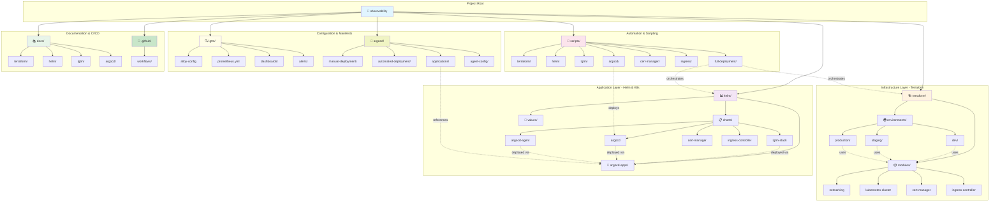

```mermaid
graph TB
    subgraph "Project Root"
        A["📁 observability"]
    end
    
    subgraph "Infrastructure Layer - Terraform"
        B["🏗️ terraform/"]
        B1["📦 modules/"]
        B2["🌍 environments/"]
        B1_1["networking"]
        B1_2["kubernetes-cluster"]
        B1_3["cert-manager"]
        B1_4["ingress-controller"]
        B2_1["dev/"]
        B2_2["staging/"]
        B2_3["production/"]
    end
    
    subgraph "Application Layer - Helm & K8s"
        C["📊 helm/"]
        C1["📋 charts/"]
        C2["🎯 values/"]
        C3["📌 argocd-apps/"]
        C1_1["lgtm-stack"]
        C1_2["argocd"]
        C1_3["argocd-agent"]
        C1_4["cert-manager"]
        C1_5["ingress-controller"]
    end
    
    subgraph "Configuration & Manifests"
        D["🔍 lgtm/"]
        E["🔄 argocd/"]
        D1["alloy-config"]
        D2["prometheus.yml"]
        D3["dashboards/"]
        D4["alerts/"]
        E1["manual-deployment/"]
        E2["automated-deployment/"]
        E3["applications/"]
        E4["agent-config/"]
    end
    
    subgraph "Automation & Scripting"
        F["🔧 scripts/"]
        F1["terraform/"]
        F2["helm/"]
        F3["lgtm/"]
        F4["argocd/"]
        F5["cert-manager/"]
        F6["ingress/"]
        F7["full-deployment/"]
    end
    
    subgraph "Documentation & CI/CD"
        G["📚 docs/"]
        H["🔄 .github/"]
        G1["terraform/"]
        G2["helm/"]
        G3["lgtm/"]
        G4["argocd/"]
        H1["workflows/"]
    end
    
    A --> B
    A --> C
    A --> D
    A --> E
    A --> F
    A --> G
    A --> H
    
    B --> B1
    B --> B2
    B1 --> B1_1
    B1 --> B1_2
    B1 --> B1_3
    B1 --> B1_4
    B2 --> B2_1
    B2 --> B2_2
    B2 --> B2_3
    
    C --> C1
    C --> C2
    C --> C3
    C1 --> C1_1
    C1 --> C1_2
    C1 --> C1_3
    C1 --> C1_4
    C1 --> C1_5
    
    D --> D1
    D --> D2
    D --> D3
    D --> D4
    E --> E1
    E --> E2
    E --> E3
    E --> E4
    
    F --> F1
    F --> F2
    F --> F3
    F --> F4
    F --> F5
    F --> F6
    F --> F7
    
    G --> G1
    G --> G2
    G --> G3
    G --> G4
    
    H --> H1
    
    B2_1 -.->|uses| B1
    B2_2 -.->|uses| B1
    B2_3 -.->|uses| B1
    
    C1_1 -.->|deployed via| C3
    C1_2 -.->|deployed via| C3
    C1_3 -.->|deployed via| C3
    
    E3 -.->|references| C3
    F7 -.->|orchestrates| B
    F7 -.->|orchestrates| C
    F4 -.->|deploys| C1_2
    
    style A fill:#e1f5ff
    style B fill:#fff3e0
    style C fill:#f3e5f5
    style D fill:#fffde7
    style E fill:#f0f4c3
    style F fill:#fce4ec
    style G fill:#e8f5e9
    style H fill:#c8e6c9
```
