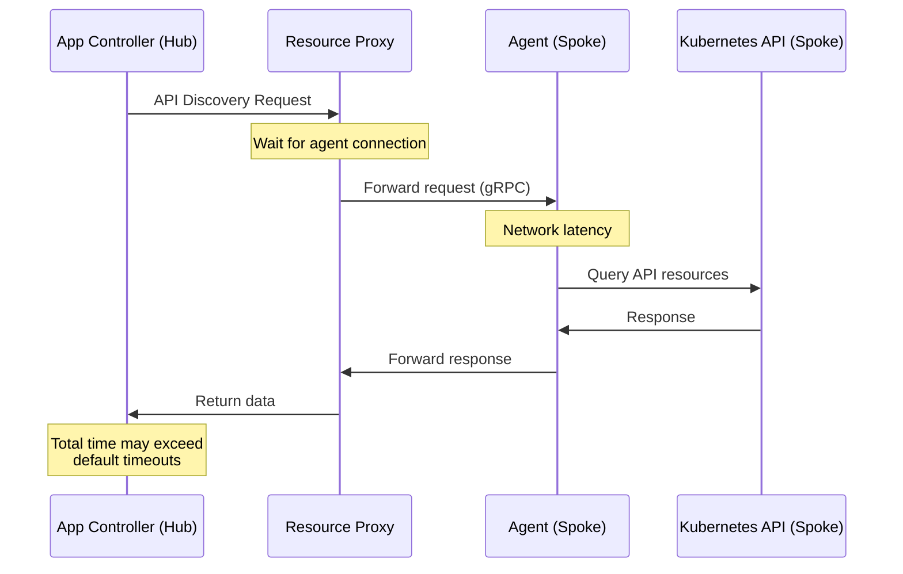

# ArgoCD Agent Terraform - Timeout Configuration Guide

## Overview

The ArgoCD Agent architecture introduces additional latency due to multi-hop communication through the resource-proxy. This guide documents all timeout-related configuration and tuning recommendations.

## Why Timeouts Matter

### Agent Architecture Latency

In a hub-and-spoke architecture, requests travel through multiple hops:

```
Application Controller → Resource-Proxy → Agent → Principal → Hub → Spoke Cluster
```

Default ArgoCD timeouts (60s repo server, 180s reconciliation) are **insufficient** for this multi-hop communication pattern.

### Communication Flow



## Timeout Variables

### Deployment Timeouts

#### `kubectl_timeout`

**Purpose**: Maximum wait time for Kubernetes resource rollouts (deployments, pods becoming ready)

**Default**: `300s` (5 minutes)

**Used For**:
- Waiting for ArgoCD server deployment
- Waiting for Principal deployment
- Waiting for Agent deployment
- Pod readiness checks

**Recommended Values**:

| Environment | Value | Rationale |
|-------------|-------|-----------|
| Development | `300s` | Fast local clusters |
| Staging | `300s` | Standard cloud deployments |
| Production | `600s` | HA configurations, slower image pulls |

**Example**:
```hcl
kubectl_timeout = "600s"  # 10 minutes for production HA
```

**Validation**:
- Must match format: `^[0-9]+[smh]$` (e.g., `300s`, `5m`, `1h`)
- Minimum: 60s
- Maximum: 3600s (1 hour)

---

#### `namespace_delete_timeout`

**Purpose**: Maximum wait time for namespace deletion (finalizers, resource cleanup)

**Default**: `120s` (2 minutes)

**Used For**:
- Terraform destroy operations
- Namespace cleanup during upgrades

**Recommended Values**:

| Environment | Value | Rationale |
|-------------|-------|-----------|
| All | `120s` | Sufficient for most cleanup operations |
| Large deployments | `300s` | Many resources, slow finalizers |

**Example**:
```hcl
namespace_delete_timeout = "120s"
```

---

### Installation Retry Configuration

#### `argocd_install_retry_attempts`

**Purpose**: Number of retry attempts for ArgoCD manifest installation (handles transient network issues)

**Default**: `5`

**Used For**:
- `kubectl apply` failures due to:
  - GitHub API rate limits
  - Network timeouts fetching manifests
  - Temporary CRD API unavailability

**Recommended Values**:

| Environment | Value | Rationale |
|-------------|-------|-----------|
| Development | `3` | Fast feedback for real issues |
| Staging | `5` | Balance between speed and reliability |
| Production | `10` | Maximum resilience to transient issues |

**Example**:
```hcl
argocd_install_retry_attempts = 10
```

**Validation**: Must be between 1 and 10

---

#### `argocd_install_retry_delay`

**Purpose**: Delay between installation retry attempts (seconds)

**Default**: `15` seconds

**Used For**:
- Waiting between failed `kubectl apply` attempts
- Allowing temporary network issues to resolve

**Recommended Values**:

| Environment | Value | Rationale |
|-------------|-------|-----------|
| Development | `10s` | Fast iteration |
| Staging/Production | `15s` | Reasonable backoff |
| Rate-limited | `30s` | Avoid API throttling |

**Example**:
```hcl
argocd_install_retry_delay = 30  # 30 seconds
```

**Validation**: Must be between 5 and 60 seconds

---

### LoadBalancer Provisioning

#### `principal_loadbalancer_wait_timeout`

**Purpose**: Maximum wait time for cloud provider to provision LoadBalancer IP/hostname

**Default**: `300` seconds (5 minutes)

**Used For**:
- GKE LoadBalancer provisioning
- AWS ELB creation
- Azure Load Balancer allocation
- Principal external IP assignment

**Recommended Values**:

| Cloud Provider | Value | Rationale |
|----------------|-------|-----------|
| GKE | `300s` | Standard provisioning time |
| AWS | `300s` | ELB creation typically <5 min |
| Azure | `600s` | May be slower in some regions |
| Local (kind/minikube) | `60s` | LocalBalancer or MetalLB |

**Example**:
```hcl
principal_loadbalancer_wait_timeout = 600  # 10 minutes for Azure
```

**Validation**: Must be between 60 and 600 seconds

**Troubleshooting**:
If timeout occurs:
```bash
# Check LoadBalancer status
kubectl get svc argocd-agent-principal -n argocd

# Check events
kubectl describe svc argocd-agent-principal -n argocd

# Common issues:
# - Insufficient quota
# - Cloud API rate limiting
# - Network/firewall rules blocking provisioning
```

---

## ArgoCD Internal Timeouts

These are **automatically configured** by the Terraform modules:

### Controller Repo Server Timeout

**ConfigMap**: `argocd-cmd-params-cm`  
**Key**: `controller.repo.server.timeout.seconds`  
**Terraform Value**: `300` (5 minutes)  
**Default ArgoCD Value**: `60` (1 minute)

**Why Changed**: Resource-proxy API discovery requires more time through agent connections.

### Server Connection Status Cache

**ConfigMap**: `argocd-cmd-params-cm`  
**Key**: `server.connection.status.cache.expiration`  
**Terraform Value**: `1h`  
**Default ArgoCD Value**: `1h` (no change, for reference)

**Purpose**: Cache cluster connection status to reduce API calls to spoke clusters.

### Reconciliation Timeout

**ConfigMap**: `argocd-cm`  
**Key**: `timeout.reconciliation`  
**Terraform Value**: `600s` (10 minutes)  
**Default ArgoCD Value**: `180s` (3 minutes)

**Why Changed**: Application sync through resource-proxy takes longer due to multi-hop communication.

### Hard Reconciliation Timeout

**ConfigMap**: `argocd-cm`  
**Key**: `timeout.hard.reconciliation`  
**Terraform Value**: `0` (disabled)  
**Default ArgoCD Value**: `0` (disabled)

**Purpose**: No hard limit on reconciliation - allows complex syncs to complete.

### Resource-Proxy Timeout Configuration

**ConfigMap**: `argocd-agent-params`  
**Managed by**: `hub_principal_resource_proxy_config` and `hub_principal_env_vars_config` resources

The following timeout configurations are **automatically applied** during Terraform deployment to address API discovery timeouts in the agent architecture:

#### Principal Resource-Proxy Timeout

**Key**: `principal.resource-proxy.timeout`  
**Value**: `180s` (3 minutes)  
**Environment Variable**: `ARGOCD_PRINCIPAL_RESOURCE_PROXY_TIMEOUT`

**Purpose**: Maximum time for resource-proxy to complete individual resource requests through agent connections.

#### Request Tracker Timeout

**Key**: `principal.resource-proxy.request-tracker.timeout`  
**Value**: `300s` (5 minutes)  
**Environment Variable**: `ARGOCD_PRINCIPAL_RESOURCE_PROXY_REQUEST_TRACKER_TIMEOUT`

**Purpose**: Maximum time for tracking pending requests in the resource-proxy queue before timing out.

#### Request Tracker Queue Size

**Key**: `principal.resource-proxy.request-tracker.queue-size`  
**Value**: `1000`  
**Environment Variable**: `ARGOCD_PRINCIPAL_RESOURCE_PROXY_REQUEST_TRACKER_QUEUE_SIZE`

**Purpose**: Maximum number of concurrent requests that can be queued for processing through agents.

#### Worker Capacity

**Key**: `principal.resource-proxy.worker-capacity`  
**Value**: `50`  
**Environment Variable**: `ARGOCD_PRINCIPAL_RESOURCE_PROXY_WORKER_CAPACITY`

**Purpose**: Number of worker goroutines available to process API discovery requests concurrently.

#### API Discovery Timeout

**Key**: `principal.resource-proxy.api-discovery.timeout`  
**Value**: `180s` (3 minutes)  
**Environment Variable**: `ARGOCD_PRINCIPAL_RESOURCE_PROXY_API_DISCOVERY_TIMEOUT`

**Purpose**: Maximum time allowed for completing API discovery operations through the resource-proxy.

**Why Required**: 

The multi-hop communication pattern (Application Controller → Resource-Proxy → Agent → Principal → Spoke Cluster) introduces latency that exceeds default timeout values. Without these configurations, API discovery requests timeout before completing, causing applications to remain in "Unknown" sync status.

**Deployment Flow**:

1. `hub_principal_resource_proxy_config` patches the `argocd-agent-params` ConfigMap with timeout values
2. `hub_principal_env_vars_config` patches the `argocd-agent-principal` deployment to inject environment variables referencing ConfigMap keys
3. `hub_principal_restart` triggers a deployment rollout to apply the new configuration

**Verification**:

```bash
# Check ConfigMap values
kubectl get cm argocd-agent-params -n argocd -o yaml | grep -A 5 "resource-proxy"

# Check environment variables in Principal pod
kubectl get deployment argocd-agent-principal -n argocd -o jsonpath='{.spec.template.spec.containers[0].env[?(@.name=="ARGOCD_PRINCIPAL_RESOURCE_PROXY_TIMEOUT")]}' | jq
```

---

## Environment-Specific Recommendations

### Development Environment

**Characteristics**:
- Local clusters (kind, minikube, k3d)
- Fast image pulls (pre-cached)
- Single node or small clusters
- Quick feedback desired

**Recommended Configuration**:
```hcl
kubectl_timeout                      = "180s"  # 3 minutes
namespace_delete_timeout             = "60s"   # 1 minute
argocd_install_retry_attempts        = 3       # Fast failure
argocd_install_retry_delay           = 10      # Quick retries
principal_loadbalancer_wait_timeout  = 60      # MetalLB is fast
```

### Staging Environment

**Characteristics**:
- Cloud-hosted clusters
- Standard image pull times
- Multi-node clusters
- Balance between speed and reliability

**Recommended Configuration**:
```hcl
kubectl_timeout                      = "300s"  # 5 minutes (default)
namespace_delete_timeout             = "120s"  # 2 minutes (default)
argocd_install_retry_attempts        = 5       # Default
argocd_install_retry_delay           = 15      # Default
principal_loadbalancer_wait_timeout  = 300     # Default
```

### Production Environment

**Characteristics**:
- HA configurations (multiple replicas)
- Slower image pulls (remote registries)
- Large clusters with many nodes
- Maximum reliability required

**Recommended Configuration**:
```hcl
kubectl_timeout                      = "600s"  # 10 minutes
namespace_delete_timeout             = "240s"  # 4 minutes
argocd_install_retry_attempts        = 10      # Max retries
argocd_install_retry_delay           = 30      # Conservative backoff
principal_loadbalancer_wait_timeout  = 600     # 10 minutes
```

---

## Timeout Interaction Examples

### Example 1: Principal Deployment

**Total Time Calculation**:
```
Base installation time: ~60s
+ LoadBalancer provisioning: 120s (principal_loadbalancer_wait_timeout)
+ Certificate issuance: ~30s
+ Pod startup: ~45s
+ Health check wait: kubectl_timeout (300s)
---
Minimum total: ~255s
Maximum (with retries): ~450s
```

### Example 2: Spoke Agent Connection

**Total Time Calculation**:
```
ArgoCD installation: ~90s
+ Agent deployment: ~60s
+ Certificate provision: ~30s
+ Principal connection: ~15s
+ kubectl wait: kubectl_timeout (300s)
---
Minimum total: ~195s
Maximum (with retries): ~400s
```

### Example 3: Application Sync

**Timeout Chain**:
```
Application Controller timeout.reconciliation: 600s
  └─> Calls Resource Proxy
      Controller repo server timeout: 300s
        └─> Calls Agent
            Agent gRPC timeout: 60s (default)
              └─> Queries Spoke K8s API
                  K8s API timeout: 30s (default)
```

**Failure Modes**:
- If K8s API is slow, request may time out at Agent level (60s)
- If Agent is slow, request may time out at Controller level (300s)
- If entire sync is slow, Application may timeout at reconciliation level (600s)

---

## Troubleshooting Timeout Issues

### Issue: "deployment rollout timeout exceeded"

**Symptoms**:
```
Error: deployment/argocd-server failed to become available within 300s
```

**Diagnosis**:
```bash
# Check deployment status
kubectl get deployment argocd-server -n argocd

# Check pod events
kubectl describe pod -l app.kubernetes.io/name=argocd-server -n argocd

# Check image pull status
kubectl get events -n argocd --sort-by='.lastTimestamp'
```

**Solutions**:
1. Increase `kubectl_timeout` for slow environments
2. Check image pull times (may need larger timeout for remote registries)
3. Verify node resources are sufficient
4. Check for pending PVCs delaying startup

---

### Issue: "LoadBalancer IP pending indefinitely"

**Symptoms**:
```
Error: principal_address shows "pending" after 300s
```

**Diagnosis**:
```bash
# Check service status
kubectl get svc argocd-agent-principal -n argocd

# Check events
kubectl describe svc argocd-agent-principal -n argocd

# Check cloud provider quota
# GKE: gcloud compute addresses list
# AWS: aws ec2 describe-addresses
```

**Solutions**:
1. Increase `principal_loadbalancer_wait_timeout`
2. Check cloud provider resource quotas
3. Verify network configuration allows LoadBalancer creation
4. Consider using NodePort for development

---

### Issue: "Application sync timeouts"

**Symptoms**:
- Applications stuck in "Unknown/Unknown" health/sync status
- Application Controller logs show: `context deadline exceeded`

**Diagnosis**:
```bash
# Check ArgoCD ConfigMaps
kubectl get cm argocd-cmd-params-cm -n argocd -o yaml | grep timeout
kubectl get cm argocd-cm -n argocd -o yaml | grep timeout

# Check Application Controller logs
kubectl logs -n argocd -l app.kubernetes.io/name=argocd-application-controller --tail=100 | grep timeout
```

**Solutions**:
Terraform automatically configures these, but verify:
```bash
# Should show: 300
kubectl get cm argocd-cmd-params-cm -n argocd \
  -o jsonpath='{.data.controller\.repo\.server\.timeout\.seconds}'

# Should show: 600s
kubectl get cm argocd-cm -n argocd \
  -o jsonpath='{.data.timeout\.reconciliation}'
```

If missing, run:
```bash
terraform apply -refresh-only
terraform apply  # Will reconfigure
```

---

## Best Practices

### 1. Start Conservative
Begin with **higher timeouts** in production and reduce after observing actual times:
```hcl
kubectl_timeout = "600s"  # Start high
```

Monitor actual deployment times, then adjust:
```bash
# Measure actual deployment time
time kubectl rollout status deployment/argocd-server -n argocd
```

### 2. Account for Retries
Total deployment time = `base_time + (retry_attempts × retry_delay)`

Example:
```
Base install: 60s
Retries: 5 attempts × 15s delay = 75s
Total worst case: 135s
```

Set `kubectl_timeout` > total worst case.

### 3. Match Cloud Provider SLAs
Check your cloud provider's typical LoadBalancer provisioning times:
- GKE: 2-3 minutes typical
- AWS ELB: 3-5 minutes typical  
- Azure: 5-8 minutes typical

Set `principal_loadbalancer_wait_timeout` accordingly.

### 4. Test Timeout Values
Run deployment in staging with monitoring:
```bash
# Deploy with verbose logging
export TF_LOG=DEBUG
terraform apply 2>&1 | tee deployment.log

# Analyze times
grep "Waiting for" deployment.log
grep "✓" deployment.log
```

### 5. Document Custom Values
If deviating from defaults, document why in `terraform.tfvars`:
```hcl
# Increased due to slow Azure LoadBalancer provisioning in westeurope region
principal_loadbalancer_wait_timeout = 600

# Increased for HA deployment with 3 Principal replicas
kubectl_timeout = "600s"
```

---

## Quick Reference

### Default Values Summary

| Variable | Default | Min | Max | Can be <1m? |
|----------|---------|-----|-----|-------------|
| `kubectl_timeout` | 300s | 60s | 3600s | No |
| `namespace_delete_timeout` | 120s | 30s | 600s | No |
| `argocd_install_retry_attempts` | 5 | 1 | 10 | N/A |
| `argocd_install_retry_delay` | 15 | 5 | 60 | No |
| `principal_loadbalancer_wait_timeout` | 300 | 60 | 600 | Yes (local) |

### Terraform Variable Syntax

```hcl
# environments/prod/terraform.tfvars

# Time durations use "s", "m", or "h" suffix
kubectl_timeout          = "300s"  # 5 minutes
namespace_delete_timeout = "120s"  # 2 minutes

# Numeric values (seconds)
argocd_install_retry_attempts       = 5
argocd_install_retry_delay          = 15
principal_loadbalancer_wait_timeout = 300
```

---

## Related Documentation

- [ArgoCD Agent Architecture](../../docs/argocd-agent-architecture.md)
- [Troubleshooting Guide](../../docs/argocd-agent-troubleshooting.md) - Issue #9: Resource-Proxy API Discovery Timeouts
- [Terraform Deployment Guide](../../docs/argocd-agent-terraform-deployment.md)
- [ArgoCD Reconciliation Timeouts](https://argo-cd.readthedocs.io/en/stable/operator-manual/reconciliation/)
