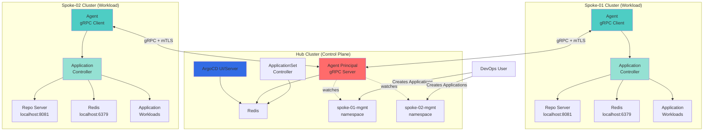
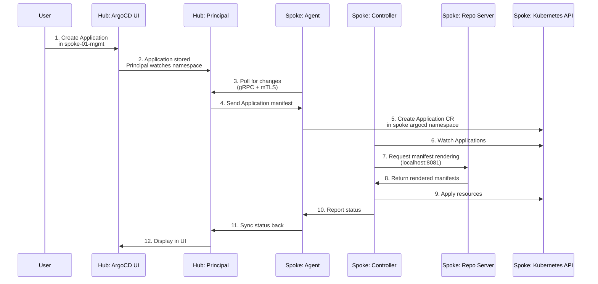

# ArgoCD Agent Architecture

## Overview

The ArgoCD Hub-and-Spoke architecture implements a centralized control plane (Hub) that manages applications across multiple workload clusters (Spokes) using the Argo CD Agent in Managed Mode with Local Repo Servers.

## Architecture Diagram



## Component Breakdown

### Hub Cluster Components

| Component | Purpose | Replicas | Network Access |
|-----------|---------|----------|----------------|
| `argocd-server` | Web UI and API server | 1-2 | Ingress (HTTPS) |
| `argocd-agent-principal` | Central agent manager | 1-2 | Ingress (gRPC/TLS), Redis |
| `redis` | Shared cache for server/principal | 1 or 3 (HA) | Internal only |
| `applicationset-controller` | ApplicationSet management | 1 | Redis |
| **NOT PRESENT** | `argocd-application-controller` | 0 | N/A |

### Spoke Cluster Components

| Component | Purpose | Replicas | Network Access |
|-----------|---------|----------|----------------|
| `argocd-agent` | Agent client (gRPC to Hub) | 1-2 | Hub Principal (outbound) |
| `argocd-application-controller` | Application reconciliation | 1 | Localhost repo-server, Redis |
| `argocd-repo-server` | Local repository service | 1-2 | Localhost only |
| `redis` | Local cache | 1 | Localhost only |

## Network Architecture

### Communication Flows



### Network Requirements

**Spoke → Hub (Required)**:
- Protocol: gRPC over TLS (mTLS)
- Port: 8443 (configurable)
- Endpoint: `agent-principal.example.com:8443`
- Authentication: Client certificate

**Hub → Spoke (NOT Allowed)**:
- No direct connectivity from Hub to Spoke
- Unidirectional communication only

**Within Spoke (Localhost)**:
- Application Controller → Repo Server: `localhost:8081`
- Application Controller → Redis: `localhost:6379`

## Application Namespace Patterns

### Pattern 1: Single Namespace per Spoke (Implemented)

```
Hub Cluster:
├── argocd (namespace)
│   └── Hub components
├── spoke-01-mgmt (namespace)
│   └── Applications for spoke-01
├── spoke-02-mgmt (namespace)
│   └── Applications for spoke-02
└── spoke-N-mgmt (namespace)
    └── Applications for spoke-N

Spoke-01 Cluster:
└── argocd (namespace)
    ├── Spoke components
    └── Mirrored Applications

Agent Configuration:
  ARGOCD_AGENT_NAMESPACE=spoke-01-mgmt
```

**Advantages**:
- Simple RBAC (single namespace per spoke)
- Clear separation between spokes
- Easy to understand and manage

### Pattern 2: Multi-Namespace Monitoring (Future Enhancement)

```
Hub Cluster:
├── argocd (namespace)
├── spoke-01-apps (namespace)
│   └── Application workloads
├── spoke-01-infra (namespace)
│   └── Infrastructure applications
├── spoke-02-apps (namespace)
└── spoke-02-infra (namespace)

Agent Configuration:
  ARGOCD_AGENT_NAMESPACE=spoke-01-apps,spoke-01-infra
```

**Advantages**:
- Logical grouping (apps vs infra)
- Finer-grained RBAC per category
- Team-based access control

**Complexity**:
- Requires ClusterRole for Agent
- RoleBindings in each watched namespace
- More complex RBAC management

## PKI Certificate Chain (Terraform-Managed)

### Certificate Hierarchy

```
Hub CA (Self-Signed)
├── Common Name: ArgoCD Agent Hub CA
├── Validity: 10 years
├── Algorithm: RSA 4096-bit
│
├── spoke-01 Client Certificate
│   ├── Common Name: spoke-01
│   ├──Validity: 1 year
│   └── Signed by: Hub CA
│
├── spoke-02 Client Certificate
│   ├── Common Name: spoke-02
│   ├── Validity: 1 year
│   └── Signed by: Hub CA
│
└── spoke-N Client Certificate
    └── ...
```

### Certificate Distribution

| Certificate | Location | Purpose |
|-------------|----------|---------|
| Hub CA (cert + key) | Hub cluster secret: `argocd-agent-ca` | Sign client certs, verify agents |
| Hub CA (cert only) | Spoke cluster secret: `argocd-agent-client-cert` | Verify Principal |
| Spoke client cert | Hub cluster secret: `<spoke-id>-client-cert` | Reference copy |
| Spoke client cert | Spoke cluster secret: `argocd-agent-client-cert` | Agent authentication |

### Terraform PKI Flow

```hcl
# 1. Generate Hub CA
tls_private_key.hub_ca (RSA 4096)
  ↓
tls_self_signed_cert.hub_ca
  ↓
kubernetes_secret.hub_ca (Hub cluster)

# 2. Generate Spoke Client Cert
tls_private_key.spoke_client (RSA 4096)
  ↓
tls_cert_request.spoke_client
  ↓
tls_locally_signed_cert.spoke_client (signed by Hub CA)
  ↓
├── kubernetes_secret.hub_spoke_client_cert (Hub cluster)
└── kubernetes_secret.spoke_client_cert (Spoke cluster)
```

## RBAC Architecture

### Hub Principal Permissions

```yaml
# ClusterRole for cross-namespace access
apiVersion: rbac.authorization.k8s.io/v1
kind: ClusterRole
metadata:
  name: argocd-agent-principal
rules:
- apiGroups: ["argoproj.io"]
  resources: ["applications", "applicationsets", "appprojects"]
  verbs: ["get", "list", "watch", "update", "patch"]

# Role in core argocd namespace (full access)
---
apiVersion: rbac.authorization.k8s.io/v1
kind: Role
metadata:
  name: argocd-agent-principal-core
  namespace: argocd
rules:
- apiGroups: ["*"]
  resources: ["*"]
  verbs: ["*"]

# Role in each spoke management namespace
---
apiVersion: rbac.authorization.k8s.io/v1
kind: Role
metadata:
  name: argocd-agent-principal
  namespace: spoke-01-mgmt
rules:
- apiGroups: ["argoproj.io"]
  resources: ["applications"]
  verbs: ["get", "list", "watch", "update", "patch"]
```

### Spoke Agent Permissions (Pattern 1)

```yaml
# Role in spoke argocd namespace (full access)
apiVersion: rbac.authorization.k8s.io/v1
kind: Role
metadata:
  name: argocd-agent
  namespace: argocd
rules:
- apiGroups: ["*"]
  resources: ["*"]
  verbs: ["*"]
```

## Deployment Modes

| Mode | Hub | Spoke | Use Case |
|------|-----|-------|----------|
| **Full** | ✅ | ✅ | Complete Hub-and-Spoke setup |
| **Hub-only** | ✅ | ❌ | Setup control plane first |
| **Spoke-only** | ❌ | ✅ | Add spoke to existing Hub |

### Terraform Deployment Mode Control

```hcl
# Full deployment
deploy_hub = true
deploy_spoke = true

# Hub-only deployment
deploy_hub = true
deploy_spoke = false

# Spoke-only deployment
deploy_hub = false
deploy_spoke = true
```

**Conditional Resources**:
- PKI resources created only when needed
- Provider aliases conditional on deployment mode
- Validation ensures required variables are set

## Scalability Considerations

### Single Hub Limits

| Resource | Recommended | Maximum |
|----------|-------------|---------|
| Spokes per Hub | 10-20 | 50+ |
| Applications per Spoke | 100-200 | 1000+ |
| Principal replicas | 2 | 5 |

### Scaling Strategies

**Vertical Scaling**:
- Increase Principal replica count
- Enable Redis HA mode (3+ replicas)
- Increase resources on Principal pods

**Horizontal Scaling**:
- Multiple Hubs for isolation (dev/staging/prod)
- Regional Hubs for geographic distribution
- Dedicated Hubs per team/organization

## Security Model

### Threat Model

**Assumptions**:
- Spokes may be compromised
- Hub is trusted and secured
- Network is untrusted

**Mitigations**:
- mTLS prevents man-in-the-middle attacks
- Unidirectional communication (Spoke→Hub only)
- Least privilege RBAC
- NetworkPolicies restrict pod communication
- Application controller on Spoke (not Hub)

### Security Benefits over Centralized Model

| Aspect | Centralized | Hub-and-Spoke |
|--------|-------------|---------------|
| Hub compromise impact | All clusters | No cluster access |
| Spoke compromise impact | All clusters | Single spoke |
| Credentials storage | Hub has all | Hub has none |
| Network exposure | Hub→All spokes | Spoke→Hub only |
| Attack surface | High | Reduced |

## Monitoring and Observability

### Metrics Endpoints

**Hub Principal**:
- Port: 8080
- Path: `/metrix`
- Metrics: gRPC connections, Application sync stats

**Spoke Agent**:
- Port: 8080
- Path: `/metrics`
- Metrics: Connection health, sync latency

### Health Checks

**Principal Health**:
```bash
kubectl exec -n argocd deployment/argocd-agent-principal -- \
  curl localhost:8080/healthz
```

**Agent Health**:
```bash
kubectl exec -n argocd deployment/argocd-agent -- \
  curl localhost:8080/healthz
```

### Logging

**Principal Logs**:
```bash
kubectl logs -n argocd -l app.kubernetes.io/name=argocd-agent-principal
```

**Agent Logs**:
```bash
kubectl logs -n argocd -l app.kubernetes.io/name=argocd-agent
```

## References

- [Argo CD Agent Documentation](https://argo-cd.readthedocs.io/en/stable/operator-manual/agent/)
- [Argo CD Architecture](https://argo-cd.readthedocs.io/en/stable/operator-manual/architecture/)
- [Terraform TLS Provider](https://registry.terraform.io/providers/hashicorp/tls/latest/docs)
