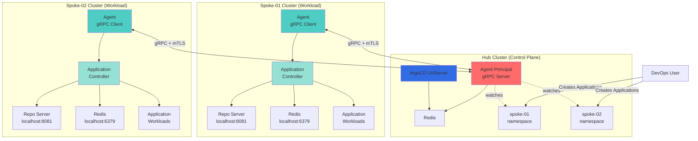
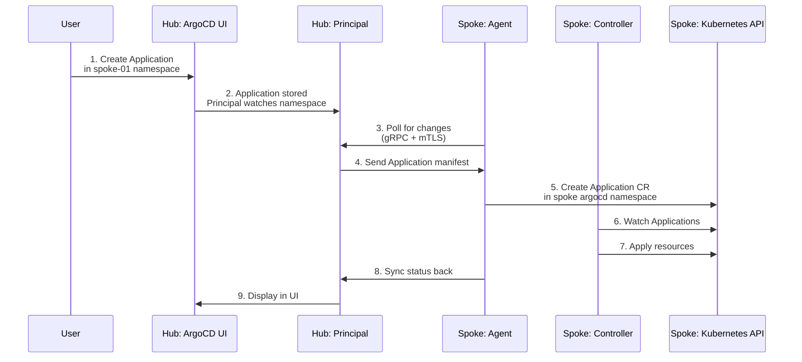

# ArgoCD Agent Architecture

Hub-and-Spoke architecture with centralized control plane managing applications across multiple workload clusters using Argo CD Agent in Managed Mode.

---

## Architecture Diagram



---

## Component Breakdown

### Hub Cluster

| Component | Purpose | Replicas | Network Access |
|-----------|---------|----------|----------------|
| `argocd-server` | Web UI and API server | 1-2 | Ingress (HTTPS) |
| `argocd-agent-principal` | Central agent manager | 1-2 | Ingress (gRPC/TLS), Redis |
| `redis` | Shared cache | 1 or 3 (HA) | Internal only |
| `applicationset-controller` | ApplicationSet management | 1 | Redis |
| **NOT PRESENT** | `argocd-application-controller` | 0 | Runs on spokes only |

### Spoke Cluster

| Component | Purpose | Replicas | Network Access |
|-----------|---------|----------|----------------|
| `argocd-agent` | Agent client (gRPC to Hub) | 1-2 | Hub Principal (outbound only) |
| `argocd-application-controller` | Application reconciliation | 1 | Localhost repo-server, Redis |
| `argocd-repo-server` | Local repository service | 1-2 | Localhost only |
| `redis` | Local cache | 1 | Localhost only |

---

## Communication Flow



---

## Network Requirements

**Spoke → Hub** (Required):
- Protocol: gRPC over TLS (mTLS)
- Port: 443 or 8443 (configurable)
- Endpoint: `agent-principal.example.com:443`
- Authentication: Client certificate (RSA 4096)

**Hub → Spoke** (NOT Allowed):
- No direct connectivity from Hub to Spoke
- Unidirectional communication only

**Within Spoke** (Localhost):
- Application Controller → Repo Server: `localhost:8081`
- Application Controller → Redis: `localhost:6379`

---

## Namespace Pattern

Hub cluster creates one namespace per spoke for application management:

```
Hub Cluster:
├── argocd (namespace)
│   └── Hub components (server, principal, redis)
├── spoke-01 (namespace)
│   └── Applications for spoke-01
├── spoke-02 (namespace)
│   └── Applications for spoke-02
└── spoke-N (namespace)
    └── Applications for spoke-N

Spoke-01 Cluster:
└── argocd (namespace)
    ├── Spoke components (agent, controller, repo-server, redis)
    └── Mirrored Applications from hub spoke-01 namespace
```

**Agent Configuration**: Each agent watches single namespace on hub (`ARGOCD_AGENT_NAMESPACE=spoke-01`)

**Advantages**:
- Simple RBAC (one namespace per spoke)
- Clear separation between spokes
- Easy to understand and manage

---

## PKI Certificate Hierarchy

All PKI operations fully automated via Terraform:

```
Hub CA (Self-Signed)
├── RSA 4096-bit
├── Validity: 10 years
├── Stored: Hub cluster secret `argocd-agent-ca`
│
└── Spoke Client Certificates
    ├── spoke-01 (RSA 4096, 1 year validity)
    ├── spoke-02 (RSA 4096, 1 year validity)
    └── spoke-N (RSA 4096, 1 year validity)
    └── Stored: Spoke cluster secret `argocd-agent-client-cert`
```

**Certificate Distribution**:

| Certificate | Location | Purpose |
|-------------|----------|---------|
| Hub CA (cert + key) | Hub: `argocd-agent-ca` | Sign client certs, verify agents |
| Hub CA (cert only) | Spoke: `argocd-agent-client-cert` | Verify Principal |
| Spoke client cert | Spoke: `argocd-agent-client-cert` | Agent authentication |

See [Operations Guide](argocd-agent-operations.md#certificate-management) for rotation procedures.

---

## RBAC Architecture

**Hub Principal Permissions**:
- ClusterRole: Read Applications across all spoke namespaces
- Role (argocd namespace): Full access to core ArgoCD resources
- Role (each spoke namespace): Read/update Applications

**Spoke Agent Permissions**:
- Role (argocd namespace): Full access to local ArgoCD resources

See [RBAC Guide](argocd-agent-rbac.md) for detailed policies and Keycloak integration.

---

## Deployment Modes

| Mode | Hub | Spoke | Use Case |
|------|-----|-------|----------|
| **Full** | Yes | Yes | Complete hub-and-spoke setup |
| **Hub-only** | Yes | No | Setup control plane first |
| **Spoke-only** | No | Yes | Add spoke to existing hub |

**Terraform Control**:
```hcl
deploy_hub = true    # Deploy hub components
deploy_spokes = true # Deploy spoke agents
```

---

## Scalability

### Single Hub Capacity

| Resource | Recommended | Maximum |
|----------|-------------|---------|
| Spokes per Hub | 10-20 | 50+ |
| Applications per Spoke | 100-200 | 1000+ |
| Principal replicas | 2 | 5 |

### Scaling Strategies

**Vertical**: Increase Principal replicas (2-3), enable Redis HA (3 replicas)

**Horizontal**: Multiple Hubs for isolation (dev/staging/prod, per-region, per-team)

See [Operations Guide](argocd-agent-operations.md#scaling-operations) for scaling procedures.

---

## Security Model

### Threat Model

**Assumptions**:
- Spokes may be compromised
- Hub is trusted and secured
- Network is untrusted

**Mitigations**:
- mTLS prevents man-in-the-middle attacks
- Unidirectional communication (Spoke→Hub only)
- Least privilege RBAC
- Application controller on spoke (not hub)
- No cluster credentials stored on hub

### Security Benefits vs Centralized ArgoCD

| Aspect | Centralized | Hub-and-Spoke |
|--------|-------------|---------------|
| Hub compromise impact | All clusters accessible | No cluster access |
| Spoke compromise impact | All clusters at risk | Single spoke only |
| Credentials storage | Hub has all cluster credentials | Hub has none |
| Network exposure | Hub→All spokes | Spoke→Hub only |

---

## Monitoring

### Metrics Endpoints

**Hub Principal**:
- Port: 8080
- Path: `/metrics`
- Metrics: gRPC connections, Application sync stats

**Spoke Agent**:
- Port: 8080
- Path: `/metrics`
- Metrics: Connection health, sync latency

**Health Checks**:
```bash
# Principal
kubectl exec -n argocd deployment/argocd-agent-principal -- curl localhost:8080/healthz

# Agent
kubectl exec -n argocd deployment/argocd-agent -- curl localhost:8080/healthz
```

See [Operations Guide](argocd-agent-operations.md#monitoring) for Prometheus configuration and alerting rules.

---

## Decision: When to Use ArgoCD Agent?

**Use Agent (Hub-Spoke)** when:
- Managing 5+ clusters across networks/clouds
- Clusters behind NAT/firewalls need centralized GitOps
- Need local repo servers per cluster for compliance
- Require security isolation between hub and workload clusters

**Use Standard ArgoCD** when:
- < 5 clusters in same VPC with full mesh connectivity
- Need full UI features (terminal, pod logs, tree view)
- Operational simplicity prioritized over security isolation

---

**Related Guides**:
- [Deployment](argocd-agent-terraform-deployment.md) - Initial setup
- [Configuration](argocd-agent-configuration.md) - All Terraform variables
- [Operations](argocd-agent-operations.md) - Day-2 operations, scaling, certificates
- [RBAC](argocd-agent-rbac.md) - Keycloak SSO and permissions
- [Troubleshooting](argocd-agent-troubleshooting.md) - Issue resolution
- [Argo CD Agent Docs](https://argo-cd.readthedocs.io/en/stable/operator-manual/agent/)
