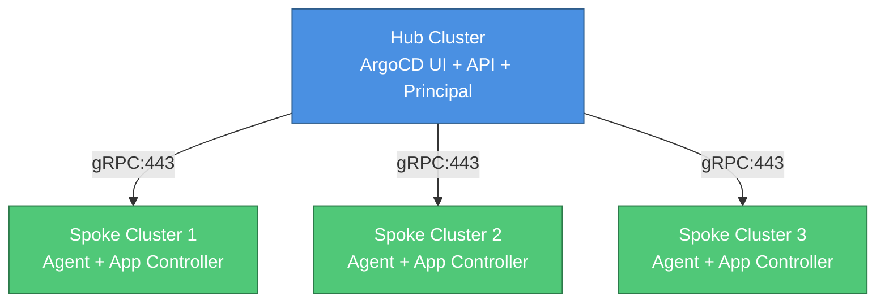

# ArgoCD Agent - Terraform Deployment Guide

Hub-and-spoke multi-cluster GitOps deployment with Terraform.

## Architecture

### Hub-and-Spoke Model



**Hub Cluster**: ArgoCD control plane (UI, API, Principal server)  
**Spoke Clusters**: Lightweight agents + application controllers

### When to Use ArgoCD Agent

**Use Agent if**:
- Managing 5+ clusters across networks/clouds
- Clusters behind NAT/firewalls
- Need local repo servers per cluster
- Want centralized control with distributed execution

**Use Standard ArgoCD if**:
- < 5 clusters in same VPC
- Full mesh connectivity available
- Need full UI features (terminal, pod logs)

---

## State Management

Terraform state tracks hub and spoke deployments separately.

### State File Locations

```
Hub:   <bucket>/terraform/argocd-agent-hub/
Spoke: <bucket>/terraform/argocd-agent-spoke-<CLUSTER_NAME>/
```

### Backend Setup by Provider

**GKE (GCS)**:
```bash
export TF_STATE_BUCKET="your-bucket"
cd argocd-agent/terraform/environments/prod
bash ../../../.github/scripts/configure-backend.sh gke argocd-agent-hub
```

**EKS (S3)**:
```bash
export TF_STATE_BUCKET="your-bucket"
export AWS_REGION="us-east-1"
bash ../../../.github/scripts/configure-backend.sh eks argocd-agent-hub
```

**AKS (Azure Blob)**:
```bash
export AZURE_STORAGE_ACCOUNT="your-account"
export AZURE_STORAGE_CONTAINER="terraform-state"
bash ../../../.github/scripts/configure-backend.sh aks argocd-agent-hub
```

See [Terraform State Management Guide](terraform-state-management.md) for bucket setup.

---

## Prerequisites

| Requirement | Version | Purpose |
|-------------|---------|---------|
| Terraform | >= 1.0 | Infrastructure automation |
| kubectl | Latest | Cluster access |
| Kubernetes | 1.24-1.28 | Hub and spoke clusters |

**Network**: Spokes must reach hub Principal on port 443 (gRPC).

**Verify cluster access**:
```bash
kubectl config get-contexts
```

---

## Terraform Deployment

### Step 1: Configure Backend

```bash
cd argocd-agent/terraform/environments/prod

# GKE example
export TF_STATE_BUCKET="my-tf-state"
bash ../../../.github/scripts/configure-backend.sh gke argocd-agent-hub
```

### Step 2: Configure Variables

```bash
cp terraform.tfvars.example terraform.tfvars
```

**Minimal configuration** (development):
```hcl
hub_cluster_context = "gke_project_region_hub"
workload_clusters = {
  "agent-1" = "gke_project_region_spoke1"
}
```

**Production configuration** - see [Configuration Guide](argocd-agent-configuration.md#production-ingress--sso--ha).

### Step 3: Deploy

```bash
terraform init
terraform plan
terraform apply
```

Deployment: ~10-15 minutes.

### Step 4: Access ArgoCD

```bash
# Get URL
terraform output argocd_url

# Get password
kubectl --context=<hub> -n argocd get secret argocd-initial-admin-secret \
  -o jsonpath='{.data.password}' | base64 -d
```

---

## Configuration Options

See [Configuration Guide](argocd-agent-configuration.md) for:
- [Exposure methods](argocd-agent-configuration.md#exposure-configuration) - LoadBalancer vs Ingress
- [Keycloak SSO](argocd-agent-configuration.md#sso-with-keycloak) - OIDC authentication
- [High availability](argocd-agent-configuration.md#high-availability) - Principal replicas
- [Deployment modes](argocd-agent-configuration.md#deployment-control) - Hub-only, spokes-only, or full

---

## Verification

### Hub Cluster

```bash
export HUB_CTX="your-hub-context"

# Check pods (expect: server, principal, repo-server, redis)
kubectl --context=$HUB_CTX get pods -n argocd

# Principal logs
kubectl --context=$HUB_CTX logs -n argocd -l app.kubernetes.io/name=argocd-agent-principal
```

### Spoke Cluster

```bash
export SPOKE_CTX="your-spoke-context"

# Check pods (expect: agent, application-controller, repo-server, redis)
kubectl --context=$SPOKE_CTX get pods -n argocd

# Agent connectivity
kubectl --context=$SPOKE_CTX logs -n argocd -l app.kubernetes.io/name=argocd-agent | grep "connected"
```

### End-to-End Test

```bash
# Create test app on hub
kubectl --context=$HUB_CTX apply -f - <<EOF
apiVersion: argoproj.io/v1alpha1
kind: Application
metadata:
  name: test
  namespace: agent-1
spec:
  project: default
  source:
    repoURL: https://github.com/argoproj/argocd-example-apps
    path: guestbook
    targetRevision: HEAD
  destination:
    server: https://kubernetes.default.svc
    namespace: default
  syncPolicy:
    automated: {}
EOF

# Wait for sync
kubectl --context=$HUB_CTX wait --for=jsonpath='{.status.sync.status}'=Synced \
  app/test -n agent-1 --timeout=300s

# Verify on spoke
kubectl --context=$SPOKE_CTX get deploy -n default guestbook-ui

# Cleanup
kubectl --context=$HUB_CTX delete app test -n agent-1
```

---

## Adding Spoke Clusters

### Deploy Additional Spoke

```bash
# Configure spoke backend
export SPOKE_NAME="spoke-cluster-2"
cd argocd-agent/terraform/modules/spoke-cluster
bash ../../../.github/scripts/configure-backend.sh gke "argocd-agent-spoke-${SPOKE_NAME}"

# Initialize and deploy
terraform init
cat > terraform.tfvars <<EOF
spoke_cluster_name     = "${SPOKE_NAME}"
spoke_cluster_endpoint = "https://spoke-2-endpoint"
hub_principal_url      = "hub-principal.argocd.svc.cluster.local:8443"
agent_namespace        = "argocd-agent"
EOF

terraform plan
terraform apply

# Verify
kubectl --context=<spoke-2-ctx> get pods -n argocd-agent
```

---

## Post-Deployment

### DNS Configuration

```bash
# Get LoadBalancer IPs
kubectl --context=$HUB_CTX get svc -n argocd argocd-server -o jsonpath='{.status.loadBalancer.ingress[0].ip}'
kubectl --context=$HUB_CTX get svc -n argocd argocd-agent-principal -o jsonpath='{.status.loadBalancer.ingress[0].ip}'
```

Create DNS A records:
- `argocd.example.com` → UI IP
- `principal.example.com` → Principal IP

### Backup PKI CA

```bash
kubectl --context=$HUB_CTX get secret argocd-agent-ca -n argocd -o yaml > pki-ca-backup.yaml
```

Store offline securely.

---

## Troubleshooting

| Issue | Solution |
|-------|----------|
| **State lock error** | Wait for other run or `terraform force-unlock LOCK_ID` |
| **Bucket not found** | Create state bucket (see [State Management Guide](terraform-state-management.md)) |
| **Backend config changed** | Run `terraform init -reconfigure` |
| **LoadBalancer stuck** | Check quotas: `kubectl describe svc -n argocd` |
| **Agent can't connect** | Test network: `curl -v https://PRINCIPAL_IP:443` from spoke |
| **Apps stuck "Unknown"** | Restart agent: `kubectl delete pod -l app.kubernetes.io/name=argocd-agent -n argocd` |
| **Hub/spoke state conflict** | Verify separate state paths: hub vs spoke-<NAME> |

See [Troubleshooting Guide](argocd-agent-troubleshooting.md) for detailed solutions.

---

## Shell Script Deployment (Alternative)

For manual control, use provided scripts:

```bash
cd argocd-agent/scripts

export HUB_CTX=gke_project_region_hub
export SPOKE_CTX=gke_project_region_spoke1

# Download argocd-agentctl v0.5.3
curl -LO https://github.com/argoproj-labs/argocd-agent/releases/download/v0.5.3/argocd-agentctl-linux-amd64
mv argocd-agentctl-linux-amd64 argocd-agentctl && chmod +x argocd-agentctl

# Deploy
HUB_CTX=$HUB_CTX ./01-hub-setup.sh
HUB_CTX=$HUB_CTX ./02-hub-pki-principal.sh agent-1
./03-spoke-setup.sh $SPOKE_CTX
HUB_CTX=$HUB_CTX ./04-agent-connect.sh agent-1 $SPOKE_CTX
HUB_CTX=$HUB_CTX ./05-verify.sh agent-1 $SPOKE_CTX
```

---

## Next Steps

- [Operations Guide](argocd-agent-operations.md) - Scaling, upgrades, monitoring
- [RBAC & SSO](argocd-agent-rbac.md) - Keycloak integration
- [Troubleshooting](argocd-agent-troubleshooting.md) - Common issues
