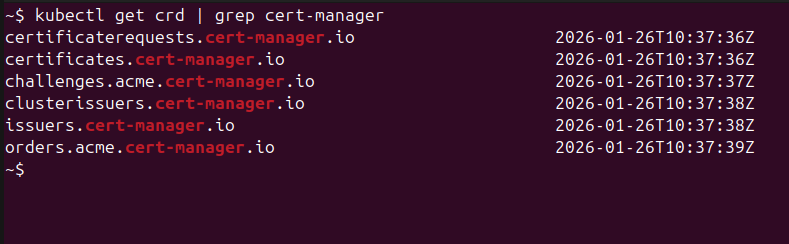

# cert-manager Manual Deployment

Direct Helm-based deployment for command-line control.

Recommended for local development environments, learning, or clusters without CI/CD infrastructure. This method provides step-by-step control over the deployment process.

**Official Documentation**: [cert-manager.io/docs](https://cert-manager.io/docs/) | **GitHub**: [cert-manager/cert-manager](https://github.com/cert-manager/cert-manager) | **Version**: `v1.19.2`

---

## Prerequisites

Required tools and versions:

| Tool | Version | Verification Command |
|------|---------|---------------------|
| kubectl | ≥ 1.24 | `kubectl version --client` |
| Helm | ≥ 3.12 | `helm version` |
| Kubernetes cluster | ≥ 1.24 | `kubectl version` |

**Dependencies:**
- NGINX Ingress Controller must be installed ([deployment guide](ingress-controller-manual-deployment.md))
- Cluster access configured (`kubectl cluster-info` returns cluster information)

**Note:** Deploy NGINX Ingress Controller before cert-manager. cert-manager requires the ingress controller for HTTP-01 ACME challenge validation.

---

## Installation

### Step 1: Verify Cluster Context

Confirm connection to the correct cluster:

```bash
kubectl config current-context

kubectl cluster-info

kubectl get nodes
```

To switch to a different cluster context:
```bash
kubectl config get-contexts
kubectl config use-context <context-name>
```

---

### Step 2: Add Helm Repository

Add the Jetstack Helm repository:

```bash
helm repo add jetstack https://charts.jetstack.io
helm repo update
```

Verify repository addition:
```bash
helm search repo jetstack/cert-manager
```

---

### Step 3: Install cert-manager

Deploy cert-manager with Custom Resource Definitions:

```bash
helm install cert-manager jetstack/cert-manager \
  --namespace cert-manager \
  --create-namespace \
  --version v1.19.2 \
  --set installCRDs=true
```

This command:
- Creates `cert-manager` namespace
- Installs three deployments: controller, webhook, cainjector
- Installs Custom Resource Definitions (CRDs) for Certificate, Issuer, ClusterIssuer, etc.
- Configures RBAC and service accounts

Installation typically completes in 30-60 seconds.

---

### Step 4: Verify Installation

Check pod status:

```bash
kubectl get pods -n cert-manager
```

All three pods should be in Running status:


Wait for all pods to reach ready state:
```bash
kubectl wait --for=condition=ready pod \
  -l app.kubernetes.io/instance=cert-manager \
  -n cert-manager \
  --timeout=300s
```

Verify CRD installation:
```bash
kubectl get crd | grep cert-manager
```

You should see the cert-manager Custom Resource Definitions:



---

## Post-Installation Configuration

After cert-manager is successfully installed, configure a certificate issuer to enable automatic TLS certificate provisioning.

### Step 1: Create ClusterIssuer Manifest

Create a ClusterIssuer for Let's Encrypt production:

```bash
cat > letsencrypt-prod-issuer.yaml <<EOF
apiVersion: cert-manager.io/v1
kind: ClusterIssuer
metadata:
  name: letsencrypt-prod
spec:
  acme:
    server: https://acme-v02.api.letsencrypt.org/directory
    email: admin@yourcompany.com
    privateKeySecretRef:
      name: letsencrypt-prod-account-key
    solvers:
    - http01:
        ingress:
          class: nginx
EOF
```

**Configuration fields:**
- `server` - Let's Encrypt API endpoint (production)
- `email` - Email address for certificate expiration notifications
- `privateKeySecretRef` - Secret name for storing Let's Encrypt account key
- `solvers` - Domain ownership validation method (HTTP-01 via NGINX ingress)

**For testing environments**, use the staging server to avoid rate limits:
```yaml
server: https://acme-staging-v02.api.letsencrypt.org/directory
```

---

### Step 2: Apply Configuration

```bash
kubectl apply -f letsencrypt-prod-issuer.yaml
```

Expected output:
```
clusterissuer.cert-manager.io/letsencrypt-prod created
```

---

### Step 3: Verify Issuer Status

```bash
kubectl get clusterissuer letsencrypt-prod
```

The ClusterIssuer should show READY status:


The `READY: True` status indicates successful Let's Encrypt account registration and proper configuration.

If not ready, check details:
```bash
kubectl describe clusterissuer letsencrypt-prod
```

**Common initialization states:**
- Email validation in progress
- Account registration with Let's Encrypt pending
- Wait 10-30 seconds and verify again

---

## Usage

For usage examples and configuring automatic TLS certificates, see [cert-manager README](../cert-manager/README.md#usage-example).

---

## Upgrading cert-manager

Update to a newer version:

```bash
# Update Helm repository
helm repo update

# Check available versions
helm search repo jetstack/cert-manager --versions

# Upgrade to new version
helm upgrade cert-manager jetstack/cert-manager \
  --namespace cert-manager \
  --version v1.20.0
```

Helm performs a rolling update with zero downtime.

---

## Uninstalling

**Warning:** Uninstalling deletes all certificates and CRDs. Applications will lose TLS functionality.

```bash
# Uninstall Helm release
helm uninstall cert-manager -n cert-manager

# Delete namespace
kubectl delete namespace cert-manager
```

**CRDs are not automatically deleted.** To fully remove cert-manager:

```bash
kubectl delete crd certificaterequests.cert-manager.io
kubectl delete crd certificates.cert-manager.io
kubectl delete crd challenges.acme.cert-manager.io
kubectl delete crd clusterissuers.cert-manager.io
kubectl delete crd issuers.cert-manager.io
kubectl delete crd orders.acme.cert-manager.io
```

---

## Troubleshooting

For detailed troubleshooting, see [Troubleshooting Guide](troubleshooting-cert-manager.md).

**Quick verification:**
```bash
kubectl get pods -n cert-manager
kubectl get certificate -A
kubectl describe certificate <cert-name> -n <namespace>
```

---

## Related Documentation

- [GitHub Actions Deployment](cert-manager-github-actions.md) - Automated CI/CD deployment
- [Terraform CLI Deployment](cert-manager-terraform-deployment.md) - Infrastructure as Code deployment
- [Ingress Controller Manual Deployment](ingress-controller-manual-deployment.md) - Required dependency
- [Troubleshooting Guide](troubleshooting-cert-manager.md) - Advanced debugging
- [Adopting Existing Installation](adopting-cert-manager.md) - Migration guide

---

**Official Documentation**: [cert-manager.io/docs](https://cert-manager.io/docs/)
