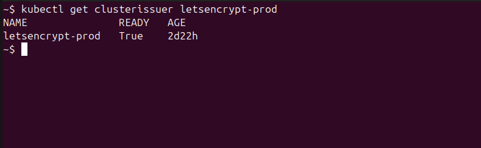

# cert-manager Terraform CLI Deployment

Infrastructure as Code deployment using Terraform for reproducible, version-controlled deployments.

Recommended for teams using infrastructure as code workflows, multi-environment deployments, or requiring reproducible configurations. This method provides full control over Terraform execution from your local machine or CI/CD pipeline.

**Official Documentation**: [cert-manager.io](https://cert-manager.io/docs/) | **GitHub**: [cert-manager/cert-manager](https://github.com/cert-manager/cert-manager) | **Version**: `v1.19.2`

> **Already have cert-manager installed?** If you want to manage an existing cert-manager deployment with Terraform, see [Adopting Existing Installation](adopting-cert-manager.md).

---

## Prerequisites

Required tools and versions:

| Tool | Version | Verification Command |
|------|---------|---------------------|
| Terraform | ≥ 1.0 | `terraform version` |
| kubectl | ≥ 1.24 | `kubectl version --client` |
| Kubernetes cluster | ≥ 1.24 | `kubectl version` |

**Cloud Provider Requirements:**
- GKE: gcloud CLI authenticated (`gcloud auth login`)
- EKS: AWS CLI authenticated (`aws configure`)
- AKS: Azure CLI authenticated (`az login`)
- Generic: kubectl configured with cluster access

**Dependencies:**
- NGINX Ingress Controller must be deployed first ([deployment guide](ingress-controller-terraform-deployment.md))
- Cluster access configured (`kubectl cluster-info`)

---

## Important: Multi-Cluster Environments

For deployments with multiple clusters, explicitly configure the target cluster in `terraform.tfvars` rather than relying on kubectl context.

**For GKE clusters:**
```bash
# Get cluster endpoint and CA certificate
gcloud container clusters describe CLUSTER_NAME \
  --region REGION \
  --project PROJECT_ID \
  --format='value(endpoint)' > endpoint.txt

gcloud container clusters describe CLUSTER_NAME \
  --region REGION \
  --project PROJECT_ID \
  --format='value(masterAuth.clusterCaCertificate)' > ca_cert.txt
```

Then configure in `terraform.tfvars`:
```hcl
gke_endpoint       = "34.123.45.67"      # From endpoint.txt
gke_ca_certificate = "LS0tLS1CRUdJ..."  # From ca_cert.txt
project_id         = "your-project-id"
```

This approach eliminates context switching and clearly specifies the target cluster in your configuration.

---

## Terraform State Management

**Remote state backends are recommended** for team collaboration and state persistence, though local state is supported for development environments.

**Supported Backend Configurations:**

| Provider | Backend | State Path |
|----------|---------|-----------|
| GKE | Google Cloud Storage (GCS) | `gs://<bucket>/terraform/cert-manager/terraform.tfstate` |
| EKS | AWS S3 + DynamoDB locking | `s3://<bucket>/terraform/cert-manager/terraform.tfstate` |
| AKS | Azure Blob Storage | `azurerm://<container>/terraform/cert-manager/terraform.tfstate` |
| Generic | Local or custom remote backend | `./terraform.tfstate` (local) |

The backend configuration is generated automatically by the `configure-backend.sh` script or manually created. **For production deployments, always use remote state.**

For detailed state management documentation, see [Terraform State Management Guide](terraform-state-management.md).

---

## Installation

### Step 1: Navigate to Terraform Directory

```bash
cd cert-manager/terraform
```

---

### Step 2: Configure Backend (Required for Remote State)

**Option A: Using the configuration script (recommended)**

For GKE:
```bash
../../.github/scripts/configure-backend.sh gke cert-manager
```

For EKS:
```bash
export TF_STATE_BUCKET="your-s3-bucket"
export AWS_REGION="us-east-1"
export TF_STATE_LOCK_TABLE="terraform-state-lock"  # Optional
../../.github/scripts/configure-backend.sh eks cert-manager
```

For AKS:
```bash
export AZURE_STORAGE_ACCOUNT="yourstorageaccount"
export AZURE_STORAGE_CONTAINER="terraform-state"
../../.github/scripts/configure-backend.sh aks cert-manager
```

For generic Kubernetes (local state):
```bash
../../.github/scripts/configure-backend.sh generic cert-manager
```

This creates `backend-config.tf` with the appropriate backend configuration.

**Option B: Manual backend configuration**

Create `backend-config.tf`:

For GKE (GCS backend):
```hcl
terraform {
  backend "gcs" {
    bucket = "your-gcs-bucket"
    prefix = "terraform/cert-manager"
  }
}
```

For EKS (S3 backend):
```hcl
terraform {
  backend "s3" {
    bucket         = "your-s3-bucket"
    key            = "terraform/cert-manager/terraform.tfstate"
    region         = "us-east-1"
    dynamodb_table = "terraform-state-lock"  # Optional, for state locking
  }
}
```

For AKS (Azure Blob backend):
```hcl
terraform {
  backend "azurerm" {
    storage_account_name = "yourstorageaccount"
    container_name       = "terraform-state"
    key                  = "terraform/cert-manager/terraform.tfstate"
  }
}
```

---

### Step 3: Create Configuration File

Copy the template and customize:

```bash
cp terraform.tfvars.template terraform.tfvars
```

**Variable Configuration Guide**

| Variable | Purpose | Configuration |
|----------|---------|---------------|
| `gke_endpoint` | Cluster API endpoint | Leave empty to use kubectl context, or specify for explicit cluster targeting |
| `gke_ca_certificate` | Cluster CA certificate | Leave empty to use kubectl context, or specify for explicit cluster targeting |
| `cloud_provider` | Target cloud platform | `gke`, `eks`, `aks`, or `generic` |
| `project_id` | GCP Project ID | Required for GKE |

**Two approaches:**

1. **Using kubectl context (simpler for single cluster):**
   ```hcl
   gke_endpoint       = ""
   gke_ca_certificate = ""
   ```

2. **Explicit configuration (recommended for multi-cluster):**
   ```hcl
   gke_endpoint       = "34.123.45.67"
   gke_ca_certificate = "LS0tLS1CRUdJTi0t..."
   ```
   
   Use the commands in the Multi-Cluster Environments section to retrieve these values.

Edit `terraform.tfvars`:

**Minimal configuration:**
```hcl
# Cloud Provider (gke, eks, aks, or generic)
cloud_provider = "gke"

# Installation Control
install_cert_manager = true
create_issuer        = true

# Let's Encrypt Configuration
letsencrypt_email = "admin@yourcompany.com"

# Optional: Version override
cert_manager_version = "v1.19.2"
```

**Full configuration options:**

```hcl
# ==============================================================================
# Cert-Manager Terraform Configuration
# ==============================================================================

# Cloud Provider
cloud_provider = "gke"  # Options: gke, eks, aks, generic

# GKE-specific (required for GKE)
project_id = "your-gcp-project-id"
region     = "us-central1"

# EKS-specific (required for EKS)
aws_region = "us-east-1"

# Installation Control
install_cert_manager = true   # Set false to manage existing installation
create_issuer        = true   # Set false to create issuer separately

# Helm Release
release_name         = "cert-manager"
namespace            = "cert-manager"
cert_manager_version = "v1.19.2"

# Certificate Issuer Configuration
letsencrypt_email  = "admin@yourcompany.com"
cert_issuer_kind   = "ClusterIssuer"  # or "Issuer" for namespace-scoped
cert_issuer_name   = "letsencrypt-prod"
issuer_namespace   = ""               # Required if cert_issuer_kind = "Issuer"

# ACME Configuration
ingress_class_name = "nginx"
issuer_server      = "https://acme-v02.api.letsencrypt.org/directory"

# For testing, use staging server to avoid rate limits:
# issuer_server = "https://acme-staging-v02.api.letsencrypt.org/directory"
```

**Configuration Variables:**

| Variable | Description | Default | Required |
|----------|-------------|---------|----------|
| `cloud_provider` | Target platform (gke/eks/aks/generic) | `gke` | Yes |
| `install_cert_manager` | Install cert-manager or manage existing | `false` | Yes |
| `letsencrypt_email` | Email for Let's Encrypt notifications | - | Yes |
| `cert_manager_version` | Chart version to install | `v1.19.2` | No |
| `create_issuer` | Create ClusterIssuer/Issuer | `true` | No |
| `cert_issuer_kind` | ClusterIssuer or Issuer | `ClusterIssuer` | No |
| `cert_issuer_name` | Name of issuer resource | `letsencrypt-prod` | No |
| `ingress_class_name` | Ingress class for HTTP-01 challenges | `nginx` | No |
| `issuer_server` | ACME server URL | Let's Encrypt prod | No |

---

### Step 4: Verify Configuration

Before deploying, verify your configuration:

```bash
# Review your terraform.tfvars
cat terraform.tfvars | grep -E "cloud_provider|project_id|gke_endpoint|install_cert_manager"
```

---

### Step 5: Initialize Terraform


```bash
terraform init
```

You should see:
```
Terraform has been successfully initialized!
```

---

### Step 6: Plan Deployment

Review changes before applying:

```bash
terraform plan
```

Review the planned changes to verify cert-manager installation, namespace creation, and ClusterIssuer configuration.

> **Note:** You should see resources to be created including the cert-manager Helm release, namespace, and ClusterIssuer manifest.

---

### Step 7: Apply Configuration

Deploy cert-manager:

```bash
terraform apply
```

Review the plan and type `yes` when prompted.

Installation typically completes in 2-3 minutes.

**To skip confirmation prompt:**
```bash
terraform apply -auto-approve
```

---

### Step 8: Verify Deployment

Check cert-manager pods:

```bash
kubectl get pods -n cert-manager
```

All three pods should be in Running status:


Verify ClusterIssuer:

```bash
kubectl get clusterissuer letsencrypt-prod
```

The ClusterIssuer should show READY status:



Check detailed status:
```bash
kubectl describe clusterissuer letsencrypt-prod
```

---

## Upgrading cert-manager

Update the version in `terraform.tfvars`:

```hcl
cert_manager_version = "v1.20.0"
```

Plan and apply the upgrade:

```bash
terraform plan
terraform apply
```

Terraform performs a rolling update with zero downtime.

---

## Managing Existing Installation

If cert-manager is already installed and you want Terraform to manage it:

1. Set `install_cert_manager = true` in `terraform.tfvars`
2. Import the existing Helm release:

```bash
terraform import 'helm_release.cert_manager[0]' cert-manager/cert-manager
```

3. Run `terraform plan` to verify no changes are detected

For detailed adoption procedures, see [Adopting Existing cert-manager Installation](adopting-cert-manager.md).

---

## Uninstalling

**Warning:** Uninstalling deletes all certificates. Applications will lose TLS functionality.

```bash
terraform destroy
```

Review the destruction plan and type `yes` when prompted.

This removes:
- Helm release `cert-manager`
- ClusterIssuer `letsencrypt-prod`
- Namespace `cert-manager`
- Custom Resource Definitions (CRDs)

---

## Troubleshooting

### Terraform-Specific Issues

**Backend initialization fails:**
```bash
# Authenticate with cloud provider
# GKE: gcloud auth application-default login
# EKS: aws configure
# AKS: az login
```
Verify `backend-config.tf` configuration and state bucket exists.

**State locking errors:**
- GCS: Check bucket permissions
- S3: Verify DynamoDB table exists
- Azure: Verify storage account access

For cert-manager-specific issues, see [Troubleshooting Guide](troubleshooting-cert-manager.md).

---

## Related Documentation

- [Manual Helm Deployment](cert-manager-manual-deployment.md) - Direct Helm command-line deployment
- [GitHub Actions Deployment](cert-manager-github-actions.md) - Automated CI/CD workflow
- [Terraform State Management](terraform-state-management.md) - Remote state configuration
- [Troubleshooting Guide](troubleshooting-cert-manager.md) - Common issues and resolutions
- [Adopting Existing Installation](adopting-cert-manager.md) - Migration guide

---

**Official Documentation**: [cert-manager.io/docs](https://cert-manager.io/docs/)
