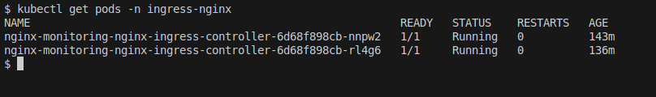
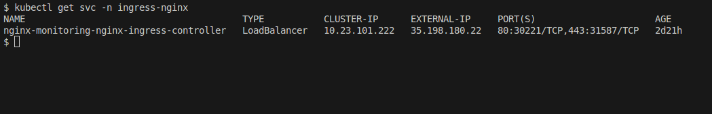
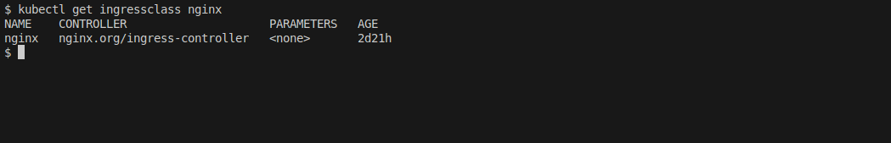

# NGINX Ingress Controller Terraform CLI Deployment

Infrastructure as Code deployment using Terraform for reproducible, version-controlled deployments.

Recommended for teams using infrastructure as code workflows, multi-environment deployments, or requiring reproducible configurations. This method provides full control over Terraform execution from your local machine or CI/CD pipeline.

**Official Documentation**: [NGINX Inc. Ingress Controller](https://docs.nginx.com/nginx-ingress-controller/) | **GitHub**: [nginxinc/kubernetes-ingress](https://github.com/nginxinc/kubernetes-ingress) | **Helm Repository**: `https://helm.nginx.com/stable` | **Version**: `2.4.2`

> **Already have NGINX Ingress Controller installed?** If you want to manage an existing ingress controller deployment with Terraform, see [Adopting Existing Installation](adopting-ingress-controller.md).

---

## Prerequisites

Required tools and versions:

| Tool | Version | Verification Command |
|------|---------|---------------------|
| Terraform | ≥ 1.0 | `terraform version` |
| kubectl | ≥ 1.24 | `kubectl version --client` |
| Kubernetes cluster | ≥ 1.24 | `kubectl version` |

**Cloud Provider Requirements:**
- GKE: gcloud CLI authenticated (`gcloud auth login`)
- EKS: AWS CLI authenticated (`aws configure`)
- AKS: Azure CLI authenticated (`az login`)
- Generic: kubectl configured with cluster access

**Infrastructure Requirements:**
- LoadBalancer support: Cluster must provision external IPs (GKE, EKS, AKS, or MetalLB for on-premise)
- Cluster access: `kubectl cluster-info` returns valid information

---

## Important: Multi-Cluster Environments

For deployments with multiple clusters, explicitly configure the target cluster in `terraform.tfvars` rather than relying on kubectl context.

**For GKE clusters:**
```bash
# Get cluster endpoint and CA certificate
gcloud container clusters describe CLUSTER_NAME \
  --region REGION \
  --project PROJECT_ID \
  --format='value(endpoint)' > endpoint.txt

gcloud container clusters describe CLUSTER_NAME \
  --region REGION \
  --project PROJECT_ID \
  --format='value(masterAuth.clusterCaCertificate)' > ca_cert.txt
```

Then configure in `terraform.tfvars`:
```hcl
gke_endpoint       = "34.123.45.67"      # From endpoint.txt
gke_ca_certificate = "LS0tLS1CRUdJ..."  # From ca_cert.txt
project_id         = "your-project-id"
``` 

---

## Terraform State Management

**Remote state backends are recommended** for team collaboration and state persistence, though local state is supported for development environments.

**Supported Backend Configurations:**

| Provider | Backend | State Path |
|----------|---------|-----------|
| GKE | Google Cloud Storage (GCS) | `gs://<bucket>/terraform/ingress-controller/terraform.tfstate` |
| EKS | AWS S3 + DynamoDB locking | `s3://<bucket>/terraform/ingress-controller/terraform.tfstate` |
| AKS | Azure Blob Storage | `azurerm://<container>/terraform/ingress-controller/terraform.tfstate` |
| Generic | Local or custom remote backend | `./terraform.tfstate` (local) |

The backend configuration is generated automatically by the `configure-backend.sh` script or manually created. **For production deployments, always use remote state.**

For detailed state management documentation, see [Terraform State Management Guide](terraform-state-management.md).

---

## Installation

### Step 1: Navigate to Terraform Directory

```bash
cd ingress-controller/terraform
```

---

### Step 2: Configure Backend (Required for Remote State)

**Option A: Using the configuration script (recommended)**

For GKE:
```bash
../../.github/scripts/configure-backend.sh gke ingress-controller
```

For EKS:
```bash
export TF_STATE_BUCKET="your-s3-bucket"
export AWS_REGION="us-east-1"
export TF_STATE_LOCK_TABLE="terraform-state-lock"  # Optional
../../.github/scripts/configure-backend.sh eks ingress-controller
```

For AKS:
```bash
export AZURE_STORAGE_ACCOUNT="yourstorageaccount"
export AZURE_STORAGE_CONTAINER="terraform-state"
../../.github/scripts/configure-backend.sh aks ingress-controller
```

For generic Kubernetes (local state):
```bash
../../.github/scripts/configure-backend.sh generic ingress-controller
```

This creates `backend-config.tf` with the appropriate backend configuration.

**Option B: Manual backend configuration**

Create `backend-config.tf`:

For GKE (GCS backend):
```hcl
terraform {
  backend "gcs" {
    bucket = "your-gcs-bucket"
    prefix = "terraform/ingress-controller"
  }
}
```

For EKS (S3 backend):
```hcl
terraform {
  backend "s3" {
    bucket         = "your-s3-bucket"
    key            = "terraform/ingress-controller/terraform.tfstate"
    region         = "us-east-1"
    dynamodb_table = "terraform-state-lock"  # Optional, for state locking
  }
}
```

For AKS (Azure Blob backend):
```hcl
terraform {
  backend "azurerm" {
    storage_account_name = "yourstorageaccount"
    container_name       = "terraform-state"
    key                  = "terraform/ingress-controller/terraform.tfstate"
  }
}
```

---

### Step 3: Create Configuration File

Copy the template and customize:

```bash
cp terraform.tfvars.template terraform.tfvars
```

**Variable Configuration Guide**

| Variable | Purpose | Configuration |
|----------|---------|---------------|
| `gke_endpoint` | Cluster API endpoint | Leave empty to use kubectl context, or specify for explicit cluster targeting |
| `gke_ca_certificate` | Cluster CA certificate | Leave empty to use kubectl context, or specify for explicit cluster targeting |
| `cloud_provider` | Target cloud platform | `gke`, `eks`, `aks`, or `generic` |
| `project_id` | GCP Project ID | Required for GKE |

**Two approaches:**

1. **Using kubectl context (simpler for single cluster):**
   ```hcl
   gke_endpoint       = ""
   gke_ca_certificate = ""
   ```

2. **Explicit configuration (recommended for multi-cluster):**
   ```hcl
   gke_endpoint       = "34.123.45.67"
   gke_ca_certificate = "LS0tLS1CRUdJTi0t..."
   ```
   
   Use the commands in the Multi-Cluster Environments section to retrieve these values.

Edit `terraform.tfvars`:

**Minimal configuration:**
```hcl
# Cloud Provider (gke, eks, aks, or generic)
cloud_provider = "gke"

# Installation Control
install_nginx_ingress = true

# Optional: Version override
nginx_ingress_version = "2.4.2"
```

**Full configuration options:**

```hcl
# ==============================================================================
# NGINX Ingress Controller Terraform Configuration
# ==============================================================================

# Cloud Provider
cloud_provider = "gke"  # Options: gke, eks, aks, generic

# GKE-specific (required for GKE)
project_id = "your-gcp-project-id"
region     = "us-central1"

# EKS-specific (required for EKS)
aws_region = "us-east-1"

# Installation Control
install_nginx_ingress = true  # Set false to manage existing installation

# Helm Release
release_name          = "nginx-monitoring"
namespace             = "ingress-nginx"
nginx_ingress_version = "2.4.2"

# Controller Configuration
replica_count      = 2  # Number of controller replicas for high availability
ingress_class_name = "nginx"
```

**Configuration Variables:**

| Variable | Description | Default | Required |
|----------|-------------|---------|----------|
| `cloud_provider` | Target platform (gke/eks/aks/generic) | `gke` | Yes |
| `install_nginx_ingress` | Install ingress controller or manage existing | `false` | Yes |
| `nginx_ingress_version` | Chart version to install | `2.4.2` | No |
| `replica_count` | Number of controller replicas | `1` | No |
| `ingress_class_name` | IngressClass name for routing | `nginx` | No |
| `release_name` | Helm release name | `nginx-monitoring` | No |
| `namespace` | Kubernetes namespace | `ingress-nginx` | No |

---

### Step 4: Verify Configuration

Before deploying, verify your configuration:

```bash
# Review your terraform.tfvars
cat terraform.tfvars | grep -E "cloud_provider|project_id|gke_endpoint|install_nginx_ingress"

```

---

### Step 5: Initialize Terraform

```bash
terraform init
```

Expected output:
```
Initializing the backend...
Successfully configured the backend "gcs"!

Initializing provider plugins...
- Installing hashicorp/helm v2.12.x...
- Installing hashicorp/kubernetes v2.x...
- Installing hashicorp/google v5.x...

Terraform has been successfully initialized!
```

---

### Step 6: Plan Deployment

Review changes before applying:

```bash
terraform plan
```

**Review the plan output:**
- Helm release `nginx-monitoring` will be created
- Namespace `ingress-nginx` will be created
- LoadBalancer service will be provisioned

Example output:
```
Terraform will perform the following actions:

  # helm_release.nginx_ingress[0] will be created
  + resource "helm_release" "nginx_ingress" {
      + chart            = "nginx-ingress"
      + namespace        = "ingress-nginx"
      + version          = "2.4.2"
      ...
    }

Plan: 2 to add, 0 to change, 0 to destroy.
```

---

### Step 7: Apply Configuration

Deploy NGINX Ingress Controller:

```bash
terraform apply
```

Review the plan and type `yes` when prompted.

Installation typically completes in 2-5 minutes (includes LoadBalancer provisioning time).

**To skip confirmation prompt:**
```bash
terraform apply -auto-approve
```

---

### Step 8: Verify Deployment

Check ingress controller pods:

```bash
kubectl get pods -n ingress-nginx
```

All controller pods should be in Running status:



Verify LoadBalancer service and external IP:

```bash
kubectl get svc -n ingress-nginx
```

The LoadBalancer should have an EXTERNAL-IP assigned:



Expected output:
```
NAME                                          TYPE           CLUSTER-IP      EXTERNAL-IP       PORT(S)
nginx-monitoring-ingress-nginx-controller     LoadBalancer   10.52.x.x       34.123.45.67      80:xxxxx/TCP,443:yyyyy/TCP
```

**The `EXTERNAL-IP` should show a public IP address** (not `<pending>`).

Save the external IP:
```bash
EXTERNAL_IP=$(kubectl get svc -n ingress-nginx \
  nginx-monitoring-ingress-nginx-controller \
  -o jsonpath='{.status.loadBalancer.ingress[0].ip}')
  
echo "External IP: $EXTERNAL_IP"
```

Verify IngressClass:

```bash
kubectl get ingressclass nginx
```

The "nginx" IngressClass should be created and ready:



Expected output:
```
NAME    CONTROLLER                      PARAMETERS   AGE
nginx   nginx.org/ingress-controller    <none>       3m
```

---

## DNS Configuration

Point your domain to the LoadBalancer external IP.

**Step 1: Get external IP**
```bash
kubectl get svc -n ingress-nginx \
  nginx-monitoring-ingress-nginx-controller \
  -o jsonpath='{.status.loadBalancer.ingress[0].ip}'
```

**Step 2: Create DNS A records**

Configure DNS records in your DNS provider:

| Type | Name | Value |
|------|------|-------|
| A | `myapp.example.com` | `<EXTERNAL-IP>` |
| A | `*.example.com` | `<EXTERNAL-IP>` (wildcard for subdomains) |

**Step 3: Wait for DNS propagation** (typically 5-30 minutes)

Test DNS resolution:
```bash
dig myapp.example.com
nslookup myapp.example.com
```

---

## Upgrading NGINX Ingress Controller

Update the version in `terraform.tfvars`:

```hcl
nginx_ingress_version = "2.5.0"
```

Plan and apply the upgrade:

```bash
terraform plan
terraform apply
```

Terraform performs a rolling update with zero downtime.

---

## Scaling Replicas

Update replica count in `terraform.tfvars`:

```hcl
replica_count = 3
```

Apply the change:

```bash
terraform apply
```

Verify scaling:
```bash
kubectl get pods -n ingress-nginx
```

---

## Uninstalling

**Warning:** Uninstalling removes the LoadBalancer and breaks all Ingress-based routing.

```bash
terraform destroy
```

Review the destruction plan and type `yes` when prompted.

This removes:
- Helm release `nginx-monitoring`
- LoadBalancer service (releases external IP)
- Namespace `ingress-nginx`
- IngressClass `nginx`

---

## Troubleshooting

### Terraform-Specific Issues

**Backend initialization fails:**
```bash
# Authenticate with cloud provider
# GKE: gcloud auth application-default login
# EKS: aws configure
# AKS: az login
```
Verify `backend-config.tf` configuration and state bucket exists.

**State locking errors:**
- GCS: Check bucket permissions
- S3: Verify DynamoDB table exists
- Azure: Verify storage account access

For ingress-specific issues, see [Troubleshooting Guide](troubleshooting-ingress-controller.md).

---

## Related Documentation

- [Manual Helm Deployment](ingress-controller-manual-deployment.md) - Direct Helm command-line deployment
- [GitHub Actions Deployment](ingress-controller-github-actions.md) - Automated CI/CD workflow
- [Terraform State Management](terraform-state-management.md) - Remote state configuration
- [Troubleshooting Guide](troubleshooting-ingress-controller.md) - Common issues and resolutions
- [Adopting Existing Installation](adopting-ingress-controller.md) - Migration guide

---

**Official Documentation**: [NGINX Inc. Ingress Controller](https://docs.nginx.com/nginx-ingress-controller/) | **Helm Repository**: `https://helm.nginx.com/stable`
