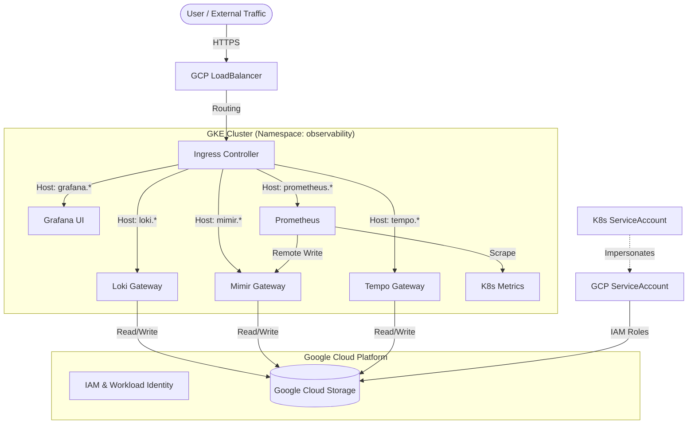

# Kubernetes Observability Stack

This document describes the architecture, deployment, and configuration of a production-grade observability stack on Google Kubernetes Engine (GKE). The stack integrates Loki, Grafana, Tempo, and Mimir (LGTM) with Prometheus to provide a complete monitoring solution for logs, metrics, and traces for any application or infrastructure.

## Overview

The observability stack is designed to be production-ready, scalable, and portable. It leverages:

- **Loki**: For distributed logging.
- **Mimir**: For long-term Prometheus metrics storage.
- **Tempo**: For distributed tracing.
- **Prometheus**: For metrics collection and scraping.
- **Grafana**: For data visualization and dashboarding.
- **Google Cloud Storage (GCS)**: For cost-effective, durable backend storage.

Infrastructure provisioning and application deployment are fully automated using Terraform and Helm.

## Architecture

The system is composed of modular components:

1.  **Core Stack (LGTM)**: The main observability components.
2.  **Cert-Manager**: Manages TLS certificates (Modular, can be deployed standalone).
3.  **Ingress Controller**: Manages external access (Modular, can be deployed standalone).



## Prerequisites

Before deploying the stack, ensure the following requirements are met:

1. **Terraform**: Version 1.0 or later installed.
2. **Google Cloud CLI**: Installed and authenticated with `gcloud auth login` and `gcloud auth application-default login`.
3. **Kubernetes Access**: `kubectl` configured with context for the target GKE cluster.
4. **Permissions**: The authenticated user must have permissions to create GCS buckets, Service Accounts, and assign IAM roles (Storage Object Admin).

## Configuration

The deployment is configured via Terraform variables. Copy the template to creating your configuration file:

```bash
cp terraform.tfvars.template terraform.tfvars
```

Edit `terraform.tfvars` to define your environment-specific values.

| Variable | Description | Required | Default |
| :--- | :--- | :---: | :--- |
| `project_id` | Google Cloud Project ID. | Yes | - |
| `cluster_name` | Name of the target GKE cluster. | Yes | - |
| `region` | GCP Region for resources (e.g., `europe-west3`). | No | `us-central1` |
| `cluster_location` | Location of the GKE cluster. | Yes | - |
| `environment` | Environment label (e.g., `prod`). | No | `production` |
| `namespace` | K8s Namespace for stack. | No | `observability` |
| `monitoring_domain` | Base domain for endpoints (e.g., `obs.example.com`). | Yes | - |
| `letsencrypt_email` | Email for ACME registration. | Yes | - |
| `grafana_admin_password` | Initial admin password for Grafana. | Yes | - |
| `k8s_service_account_name` | K8s Service Account Name. | No | `observability-sa` |
| `gcp_service_account_name` | GCP Service Account Name. | No | `gke-observability-sa` |
| `ingress_class_name` | Ingress Class Name (e.g., `nginx`). | No | `nginx` |
| `cert_issuer_name` | Name of the Cert-Manager Issuer. | No | `letsencrypt-prod` |
| `cert_issuer_kind` | Kind of Issuer (`ClusterIssuer`). | No | `ClusterIssuer` |

### Modular Component Variables
| Variable | Description | Default |
| :--- | :--- | :--- |
| `install_cert_manager` | Install Cert-Manager via Helm. | `false` |
| `cert_manager_version` | Cert-Manager chart version. | `v1.15.0` |
| `cert_manager_release_name` | Cert-Manager release name. | `cert-manager` |
| `cert_manager_namespace` | Namespace for Cert-Manager. | `cert-manager` |
| `install_nginx_ingress` | Install NGINX Ingress via Helm. | `false` |
| `nginx_ingress_version` | Ingress Controller chart version. | `4.10.1` |
| `nginx_ingress_release_name` | Ingress Controller release name. | `nginx-monitoring` |
| `nginx_ingress_namespace` | Namespace for Ingress Controller. | `ingress-nginx` |

### Version Overrides
| Variable | Description | Default |
| :--- | :--- | :--- |
| `loki_version` | Loki Helm chart version. | `6.6.4` |
| `mimir_version` | Mimir Helm chart version. | `5.5.0` |
| `tempo_version` | Tempo Helm chart version. | `1.57.0` |
| `prometheus_version` | Prometheus Helm chart version. | `25.27.0` |
| `grafana_version` | Grafana Helm chart version. | `10.3.0` |
| `loki_schema_from_date` | Date for Loki schema start (YYYY-MM-DD). | `2024-01-01` |

### Modular Components
The stack automatically provisions **Cert-Manager** and **NGINX Ingress Controller** by default using the internal modules. You can control this via:

- `install_cert_manager` (default: `false` - Must be enabled if Cert-Manager is not already present)
- `install_nginx_ingress` (default: `false` - Must be enabled if Ingress Controller is not already present)

> **Important**: Set these to `true` in your `terraform.tfvars` if you are doing a fresh install of the entire stack and need these components.

If you prefer to deploy them standalone or manually, refer to their respective documentation:
- [Cert-Manager Documentation](../cert-manager/README.md) - *See [Terraform Deployment Guide](../docs/cert-manager-terraform-deployment.md#variables) for full configuration options.*
- [Ingress Controller Documentation](../ingress-controller/README.md) - *See [Terraform Deployment Guide](../docs/ingress-controller-terraform-deployment.md#variables) for full configuration options.*

## Installation

1. **Verify Context**
   Make sure you are context-switched to the correct cluster.
   ```bash
   kubectl config current-context
   ```

2. **Clone the Repository**

    If you haven't already, clone the project repository to your local machine.

    ```bash
    git clone https://github.com/Adorsys-gis/observability.git
    cd observability
    ```

3. **Initialize Terraform**

    Navigate to the Terraform directory and initialize the project to download required providers and modules.

    ```bash
    cd lgtm-stack/terraform
    terraform init
    ```

4. **Plan Deployment**

    Generate an execution plan to verify the resources that will be created.

    ```bash
    terraform plan
    ```

5. **Apply Configuration**

    Execute the plan to provision infrastructure and deploy the application stack.

    ```bash
    terraform apply
    ```

## Verification

### Service Status

Verify that all pods are running successfully in the `<NAMESPACE>` (default: `observability`) namespace.

```bash
kubectl get pods -n <NAMESPACE>
```


### Public Endpoints

The stack exposes the following endpoints for data ingestion and visualization. Replace `<monitoring_domain>` with your configured domain (e.g., `stack.observe.camer.digital`).

| Service | Endpoint URL | Purpose | Method | Notes |
| :--- | :--- | :--- | :--- | :--- |
| **Grafana** | `https://grafana.<monitoring_domain>` | **Visualization** | GET | Main UI for dashboards and alerts. |
| **Loki** | `https://loki.<monitoring_domain>/loki/api/v1/push` | **Logs Ingestion** | POST | Send logs via HTTP (JSON/Snappy). |
| **Mimir** | `https://mimir.<monitoring_domain>/prometheus/api/v1/push` | **Metrics Ingestion** | POST | Send metrics via Prometheus Remote Write. |
| **Tempo** (HTTP) | `https://tempo-push.<monitoring_domain>/v1/traces` | **Traces Ingestion** | POST | Send traces via OTLP HTTP. |
| **Tempo** (gRPC) | `tempo-grpc.<monitoring_domain>:443` | **Traces Ingestion** | gRPC | Send traces via OTLP gRPC. |

### Manual Verification

You can verify the Write Path (Ingestion) by sending synthetic data to the exposed endpoints.

**Example Verification (Mimir Connectivity):**

```bash
curl -v -G "https://mimir.<monitoring_domain>/prometheus/api/v1/query" \
  --data-urlencode 'query=up'
```

**Example Verification (Loki Push):**

```bash
# Set timestamp to avoid shell quoting issues
TS=$(date +%s)000000000
curl -v -H "Content-Type: application/json" -XPOST \
  "https://loki.<monitoring_domain>/loki/api/v1/push" \
  --data-raw "{\"streams\": [{ \"stream\": { \"test\": \"manual_curl\" }, \"values\": [ [ \"$TS\", \"manual_test_log\" ] ] }]}"
```

### Useful API Documentation

For advanced usage, refer to the official API documentation:

- **Loki**: [Push API (Protobuf/JSON)](https://grafana.com/docs/loki/latest/reference/api/#push-log-entries-to-loki)
- **Mimir**: [Prometheus Remote Write API](https://grafana.com/docs/mimir/latest/references/http-api/#remote-write)
- **Tempo**: [OTLP HTTP API](https://grafana.com/docs/tempo/latest/configuration/?pg=docs-tempo-latest-api-otlp-http#otlp)

### Dashboard Access

Access the Grafana dashboard using the domain configured in `monitoring_domain`.

- **URL**: `https://grafana.<monitoring_domain>`
- **Username**: `admin`
- **Password**: *<grafana_admin_password>*


## Maintenance

### Upgrades

To upgrade components, update the version variables in `terraform.tfvars` or `variables.tf` and re-run `terraform apply`.

> **Note**: The current stack uses **Loki v6.20.0**. Major version upgrades should be tested in a staging environment first to ensure compatibility with the storage schema.

### Uninstallation

To remove all resources created by this module:

```bash
terraform destroy
```

> **Warning**: Google Cloud Storage buckets containing observability data have `force_destroy` set to `false` to prevent accidental data loss. If you intend to delete the data, you must empty the buckets manually before running destroy.

## Troubleshooting

### Terraform State Locks
```bash
# Fix: Unlock state if sure no other process is running
terraform force-unlock <LOCK_ID>
```

### Provider Authentication Errors
```bash
# Fix: Re-authenticate with GCP
gcloud auth application-default login
```

### Pods Pending (Resources)
```bash
# Check for InsufficientCpu/Memory events
kubectl describe pod <pod-name>

# Fix: Enable GKE Autoscaling or resize node pool
```

