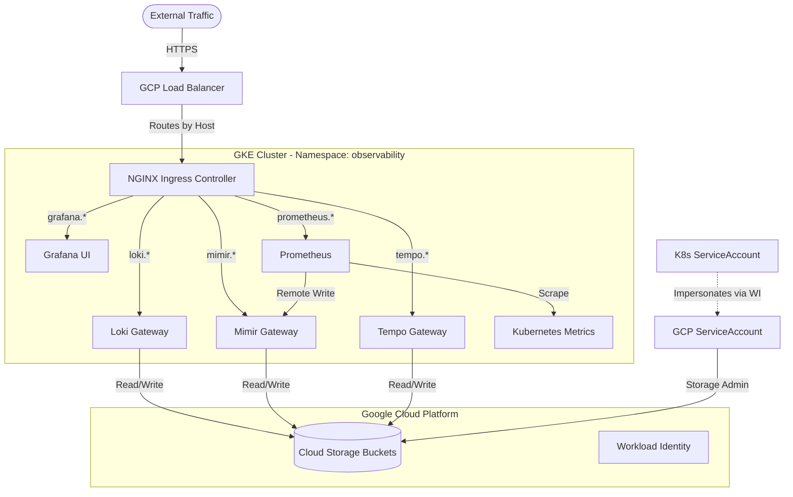
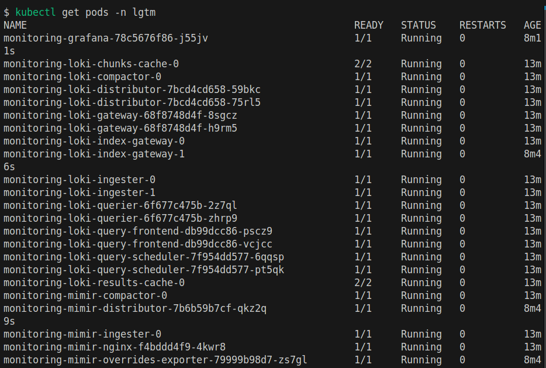
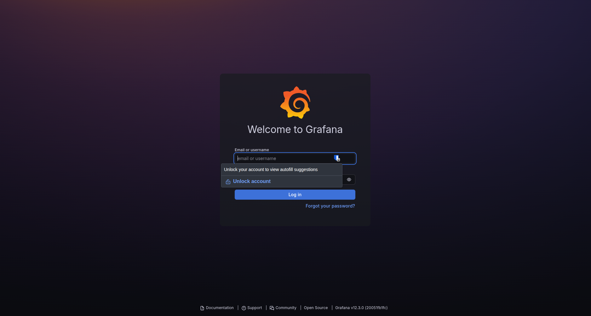

# Kubernetes Observability Stack - Terraform Deployment

Production-grade LGTM (Loki, Grafana, Tempo, Mimir) observability stack deployment on Google Kubernetes Engine using Terraform and Helm.

## Architecture

The stack provides comprehensive observability through integrated logging, metrics, and tracing with durable object storage.

### Components

| Component | Purpose | Storage Backend |
|-----------|---------|----------------|
| **Loki** | Distributed log aggregation | GCS (chunks, ruler) |
| **Mimir** | Long-term Prometheus metrics storage | GCS (blocks, ruler) |
| **Tempo** | Distributed tracing backend | GCS (traces) |
| **Prometheus** | Metrics collection and scraping | Remote write to Mimir |
| **Grafana** | Visualization and dashboarding | - |

### Infrastructure Flow



### Modular Components

The stack includes optional infrastructure components:

- **Cert-Manager**: TLS certificate automation (optional, can be shared)
- **NGINX Ingress**: External traffic management (optional, can be shared)

Set `install_cert_manager` and `install_nginx_ingress` to `false` in `terraform.tfvars` if these components are managed by other stacks.

## Prerequisites

| Requirement | Version | Purpose |
|-------------|---------|---------|
| **Terraform** | ≥ 1.5.0 | Infrastructure provisioning |
| **Google Cloud CLI** | Latest | GCP authentication and management |
| **kubectl** | ≥ 1.24 | Kubernetes cluster access |
| **Helm** | ≥ 3.12 | Chart deployment (implicit via Terraform) |

### Required GCP Permissions

The authenticated user/service account must have:

- `roles/storage.admin` - Create and manage GCS buckets
- `roles/iam.serviceAccountAdmin` - Create service accounts
- `roles/iam.serviceAccountKeyAdmin` - Manage Workload Identity bindings
- `roles/container.developer` - Access GKE clusters

### Authentication Setup

```bash
# Authenticate with GCP
gcloud auth login
gcloud auth application-default login

# Verify authentication
gcloud auth list

# Configure kubectl
gcloud container clusters get-credentials CLUSTER_NAME \
  --region=CLUSTER_REGION \
  --project=PROJECT_ID
```

---

## State Management

Terraform state tracks all deployed LGTM Stack resources for team collaboration and infrastructure consistency.

### State File Location

```
<bucket>/terraform/lgtm-stack/
```

### State Persistence

State files are stored remotely and persist across all deployments:
- Terraform always knows about existing resources
- No "resource already exists" errors
- Team members collaborate using the same state
- State locking prevents concurrent modifications

### Backend Setup

**GCS (GKE)**:
```bash
export TF_STATE_BUCKET="your-bucket"
cd lgtm-stack/terraform
bash ../../.github/scripts/configure-backend.sh gke lgtm-stack
```

**S3 (EKS)**:
```bash
export TF_STATE_BUCKET="your-bucket"
export AWS_REGION="us-east-1"
bash ../../.github/scripts/configure-backend.sh eks lgtm-stack
```

**Azure Blob (AKS)**:
```bash
export AZURE_STORAGE_ACCOUNT="your-account"
export AZURE_STORAGE_CONTAINER="terraform-state"
bash ../../.github/scripts/configure-backend.sh aks lgtm-stack
```

See [Terraform State Management Guide](terraform-state-management.md) for bucket setup.

**Note**: The generated `backend-config.tf` should not be committed. Add to `.gitignore`:
```bash
echo "backend-config.tf" >> .gitignore
```

---

## Installation

> **Existing Installation?** If you already have an LGTM stack deployed and want to manage it with Terraform, see the [Adoption Guide](adopting-lgtm-stack.md) before proceeding. The adoption process imports existing resources to avoid recreation and potential data loss.

### Step 1: Clone Repository

```bash
git clone https://github.com/Adorsys-gis/observability.git
cd observability/lgtm-stack/terraform
```

### Step 2: Configure Backend (Optional)

For remote state storage and team collaboration, configure the backend:

```bash
export TF_STATE_BUCKET="your-bucket-name"
bash ../../.github/scripts/configure-backend.sh gke lgtm-stack
```

Skip this step for local development with local state files.

### Step 3: Configure Variables

```bash
cp terraform.tfvars.template terraform.tfvars
```

Edit `terraform.tfvars` with your environment values:

```hcl
# Required Variables
project_id        = "your-gcp-project-id"
cluster_name      = "your-gke-cluster"
cluster_location  = "us-central1"
monitoring_domain = "monitoring.example.com"
letsencrypt_email = "admin@example.com"
grafana_admin_password = "secure-password-here"

# Optional: Disable if managed elsewhere
install_cert_manager  = false
install_nginx_ingress = false

# Chart versions (customize as needed)
loki_version       = "6.6.4"
mimir_version      = "5.5.0"
tempo_version      = "1.57.0"
prometheus_version = "25.27.0"
grafana_version    = "10.3.0"
```

### Complete Variable Reference

For all available variables and their descriptions, see [variables.tf](../lgtm-stack/terraform/variables.tf).

| Variable | Description | Default | Required |
|----------|-------------|---------|----------|
| `project_id` | GCP project ID | - | ✓ |
| `region` | GCP region for resources | `us-central1` | |
| `cluster_name` | GKE cluster name | - | ✓ |
| `cluster_location` | GKE cluster location | - | ✓ |
| `namespace` | Kubernetes namespace | `observability` | |
| `monitoring_domain` | Base domain for services | - | ✓ |
| `letsencrypt_email` | Let's Encrypt registration email | - | ✓ |
| `grafana_admin_password` | Grafana admin password | - | ✓ |
| `install_cert_manager` | Deploy cert-manager | `false` | |
| `install_nginx_ingress` | Deploy NGINX ingress | `false` | |
| `loki_schema_from_date` | Loki schema effective date | `2024-01-01` | |

### Step 4: Initialize Terraform

```bash
terraform init
```

### Step 5: Plan Deployment

```bash
terraform plan
```

Review the planned changes carefully before applying.

### Step 6: Apply Configuration

```bash
terraform apply
```

Type `yes` when prompted to confirm.

**Expected deployment time**: 5-10 minutes depending on cluster size and component configuration.

> **Warning**: If you see errors about resources already existing (GCS buckets, service accounts, Helm releases), **STOP** and follow the [Adoption Guide](adopting-lgtm-stack.md) to import existing resources instead of recreating them.

## Verification

### Check Pod Status

```bash
kubectl get pods -n observability
```

All pods should be in `Running` state with `READY` showing expected replicas.



### Service Endpoints

After deployment, the following endpoints are available:

| Service | Endpoint | Purpose | Protocol |
|---------|----------|---------|----------|
| **Grafana** | `https://grafana.<monitoring_domain>` | Visualization dashboard | HTTPS |
| **Loki** | `https://loki.<monitoring_domain>/loki/api/v1/push` | Log ingestion | HTTP POST |
| **Mimir** | `https://mimir.<monitoring_domain>/prometheus/api/v1/push` | Metrics ingestion (Remote Write) | HTTP POST |
| **Tempo** (HTTP) | `https://tempo-push.<monitoring_domain>/v1/traces` | Trace ingestion (OTLP HTTP) | HTTP POST |
| **Tempo** (gRPC) | `tempo-grpc.<monitoring_domain>:443` | Trace ingestion (OTLP gRPC) | gRPC |
| **Prometheus** | `https://prometheus.<monitoring_domain>` | Metrics query interface | HTTPS |

### Test Connectivity

#### Verify Mimir Query API

```bash
curl -G "https://mimir.<monitoring_domain>/prometheus/api/v1/query" \
  --data-urlencode 'query=up'
```

Expected response: JSON with query results.

#### Verify Loki Ingestion

```bash
TIMESTAMP=$(date +%s)000000000
curl -H "Content-Type: application/json" \
  -XPOST "https://loki.<monitoring_domain>/loki/api/v1/push" \
  --data-raw "{\"streams\":[{\"stream\":{\"job\":\"test\"},\"values\":[[\"$TIMESTAMP\",\"test log entry\"]]}]}"
```

Expected response: HTTP 204 No Content.

### Access Grafana

1. Navigate to `https://grafana.<monitoring_domain>`
2. Login with:
   - **Username**: `admin`
   - **Password**: Value from `grafana_admin_password`



### Verify Datasources

In Grafana, navigate to **Connections** > **Data Sources** and verify:

- **Loki** - Connected
- **Mimir** - Connected  
- **Tempo** - Connected

## Operations

### Upgrade Components

Update chart versions in `terraform.tfvars`:

```hcl
loki_version = "6.20.0"  # Updated version
```

Apply changes:

```bash
terraform apply
```

**Important**: Test major version upgrades in a non-production environment first, especially for Loki schema changes.

### View Component Logs

```bash
# Loki logs
kubectl logs -n observability -l app.kubernetes.io/name=loki --tail=100

# Mimir logs
kubectl logs -n observability -l app.kubernetes.io/name=mimir --tail=100

# Grafana logs
kubectl logs -n observability -l app.kubernetes.io/name=grafana --tail=100
```

### Scale Components

Edit Helm values files in `values/` directory, then apply:

```bash
terraform apply
```

### Uninstall

```bash
terraform destroy
```

**Warning**: GCS buckets have `force_destroy = false` by default. Empty buckets manually if you want to delete data:

```bash
gcloud storage rm -r gs://PROJECT_ID-loki-chunks/**
gcloud storage rm -r gs://PROJECT_ID-mimir-blocks/**
gcloud storage rm -r gs://PROJECT_ID-tempo-traces/**
```

## Troubleshooting

### State Management Issues

| Issue | Cause | Solution |
|-------|-------|----------|
| **Backend configuration changed** | Backend config modified/regenerated | Run `terraform init -reconfigure` |
| **State lock acquisition error** | Another process running Terraform | Wait or `terraform force-unlock LOCK_ID` |
| **Bucket does not exist** | State bucket not created | Verify: `gcloud storage ls gs://your-bucket` |
| **Permission denied on bucket** | Insufficient IAM permissions | Grant `roles/storage.admin` to service account |
| **State file not found** | First deployment or deleted state | Normal for first run; import if state was lost |

### Terraform State Lock

```bash
# Check for running Terraform processes
ps aux | grep terraform

# Force unlock (only if no other process is running)
terraform force-unlock <LOCK_ID>
```

### Authentication Errors

```bash
# Re-authenticate with GCP
gcloud auth application-default login

# Verify credentials
gcloud auth application-default print-access-token
```

### Pods Stuck in Pending

```bash
# Check pod events
kubectl describe pod <pod-name> -n observability

# Common causes:
# - Insufficient CPU/memory
# - Unbound PersistentVolumeClaims
# - Node selector constraints

# Check node resources
kubectl top nodes
```

### GCS Permission Errors

```bash
# Verify Workload Identity binding
kubectl get sa observability-sa -n observability -o yaml | grep iam.gke.io

# Check GCP IAM policy
gcloud iam service-accounts get-iam-policy \
  gke-observability-sa@PROJECT_ID.iam.gserviceaccount.com
```

For detailed troubleshooting, see [Troubleshooting Guide](troubleshooting-lgtm-stack.md).

## API Documentation

- **Loki Push API**: [grafana.com/docs/loki/latest/reference/api](https://grafana.com/docs/loki/latest/reference/api/#push-log-entries-to-loki)
- **Mimir Remote Write**: [grafana.com/docs/mimir/latest/references/http-api](https://grafana.com/docs/mimir/latest/references/http-api/#remote-write)
- **Tempo OTLP**: [grafana.com/docs/tempo/latest/api_docs](https://grafana.com/docs/tempo/latest/api_docs/)
- **Prometheus API**: [prometheus.io/docs/prometheus/latest/querying/api](https://prometheus.io/docs/prometheus/latest/querying/api/)

## Additional Resources

- [Adoption Guide](adopting-lgtm-stack.md) - Import existing installations into Terraform
- [Alloy Configuration Guide](alloy-config.md)