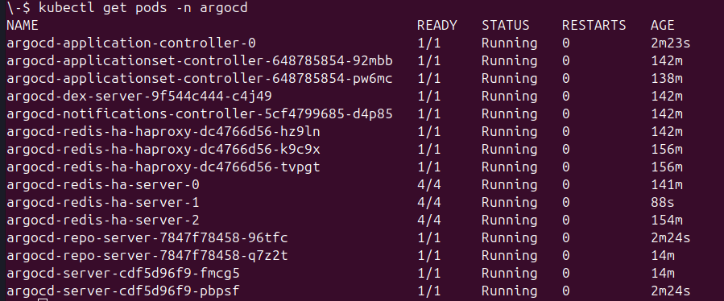

# Manual Argo CD Deployment Guide

This guide walks you through manually deploying Argo CD to your Kubernetes cluster using Helm, with production-ready configurations including high availability, HTTPS ingress, and OIDC authentication.

## Table of Contents

- [Prerequisites](#prerequisites)
- [Overview](#overview)
- [Deployment Steps](#deployment-steps)
- [Verification](#verification)
- [Post-Deployment](#post-deployment)
- [Troubleshooting](#troubleshooting)

---

## Prerequisites

Before deploying Argo CD, ensure you have the following:

### Required Tools

- **kubectl**: Kubernetes command-line tool configured to access your cluster
- **helm**: Helm 3.x installed on your local machine
- **Access to Kubernetes cluster**: With sufficient permissions to create namespaces and deploy resources

### Required Infrastructure

> [!IMPORTANT]
> **Ingress Controller Required**: This deployment assumes you already have an Nginx Ingress Controller installed in your cluster. If you don't have one set up yet, please refer to the [Ingress Controller Setup Guide](ingress-controller-manual-deployment.md) before proceeding.
> **Cert-Manager**: For automated TLS certificate management (recommended). If not installed, see [Cert-Manager Setup Guide](cert-manager-manual-deployment.md).

- **DNS Configuration**: A domain name pointing to your ingress controller's load balancer IP
- **OIDC Provider** (optional): For SSO authentication (e.g., Keycloak, Okta, Google)

---

## Overview

This deployment uses the official Argo CD Helm chart with a production-ready values file that includes:

- **High Availability**: Redis HA, multiple replicas for controller, repo-server, and API server
- **Autoscaling**: Horizontal Pod Autoscaling for repo-server and API server
- **HTTPS Ingress**: Automatic TLS certificate provisioning via cert-manager
- **OIDC Authentication**: Integration with Keycloak or other OIDC providers
- **RBAC**: Role-based access control for multi-tenancy

**Reference Configuration**: [`argocd/manual/argocd-prod-values.yaml`](../argocd/manual/argocd-prod-values.yaml)

---

## Deployment Steps

### Step 1: Create Namespace

Create a dedicated namespace for Argo CD:

```bash
kubectl create namespace argocd
```

### Step 2: Add Argo CD Helm Repository

Add the official Argo CD Helm repository:

```bash
helm repo add argo https://argoproj.github.io/argo-helm
helm repo update
```

### Step 3: Customize the Values File

Navigate to the observability project directory and edit the Argo CD values file:

```bash
# Navigate to your observability project
cd ../argocd/manual

# Edit the values file directly
# (You may use any editor, e.g., nano, vi, vim)
Edit argocd-prod-values.yaml
```

### Step 4: Configure Your Deployment

Open `argocd-prod-values.yaml` and adjust the settings to match your environment. The file is already commented to guide you through the necessary changes (Ingress hostname, Cert-Manager Issuer, OIDC configuration, etc.).

> [!WARNING]
> **Required Changes**: You MUST update the values in `argocd-prod-values.yaml` (especially the hostname and issuer) before deployment, or the installation will fail or be misconfigured.

#### 4.1 Configure OIDC (Optional)

If you're using OIDC authentication (e.g., Keycloak), you need to deploy and configure Keycloak, then integrate it with Argo CD.

> [!IMPORTANT]
> **Keycloak Setup Required**: Before proceeding, ensure Keycloak is deployed and configured. Refer to the [Keycloak Getting Started Guide](https://www.keycloak.org/guides#getting-started) for deployment instructions across all platforms.
> **Configure using**: [ArgoCD Keycloak Setup Guide](https://argo-cd.readthedocs.io/en/stable/operator-manual/user-management/keycloak/)
> During setup, ensure the following entities are created:
> - **A Realm**: (e.g., `argocd`)
> - **An OIDC Client**: (e.g., `argocd`) with the following **Valid Redirect URIs** (Required):
>   1. `https://argocd.YOUR_DOMAIN.com/auth/callback` (For browser login)
>   2. `http://localhost:8085/auth/callback` (For CLI login)
>   - **Note**: Ensure both are present in the list.
> - **Users and Groups**: For authentication and access control.

After deploying and configuring Keycloak, open your `argocd-prod-values.yaml` file and locate the `configs.cm` section.

Update the placeholders (e.g., `YOUR_KEYCLOAK_DOMAIN`, `YOUR_CLIENT_ID`, `YOUR_CLIENT_SECRET`) with your actual Keycloak values. The file is pre-configured with the necessary structure; you simply need to fill in the blanks.

**Where to find these values in Keycloak:**
- **issuer**: `https://<keycloak-domain>/realms/<realm-name>`
- **clientID**: The client ID you created in Keycloak
- **clientSecret**: Found in Keycloak under Clients → Your Client → Credentials tab

> [!TIP]
> If you're not using OIDC authentication initially, you can remove or comment out the `oidc.config` section and use the default admin user. You can add OIDC later by updating the configuration.

### Step 5: Deploy Argo CD

Deploy Argo CD using Helm with your customized values file:

```bash
helm install argocd argo/argo-cd \
  --namespace argocd \
  --values argocd-prod-values.yaml \
  --version 7.7.12
```

> [!NOTE]
> The version `7.7.12` is specified for consistency. You can check for the latest version with `helm search repo argo/argo-cd` and update accordingly.

---

## Verification


### Step 1: Check Pod Status

Verify all Argo CD pods are running:

```bash
kubectl get pods -n argocd
```

**Expected Output:**



### Step 2: Check Ingress

Verify the ingress resource was created:

```bash
kubectl get ingress -n argocd
```

Check that the ingress has an address assigned:

```bash
kubectl describe ingress argocd-server -n argocd
```

### Step 3: Verify TLS Certificate

Check that cert-manager has provisioned the TLS certificate:

```bash
kubectl get certificate -n argocd
kubectl describe certificate argocd-tls-cert -n argocd
```

The certificate should show `Ready: True`.

### Step 4: Access Argo CD UI

Open your browser and navigate to your configured domain (e.g., `https://YOUR_ARGO-CD_DOMAIN`).

You should see the Argo CD login page with HTTPS enabled.

### Step 5: Retrieve Admin Password

If not using OIDC, retrieve the initial admin password:

```bash
kubectl -n argocd get secret argocd-initial-admin-secret -o jsonpath="{.data.password}" | base64 -d && echo
```

Login with:
- **Username**: `admin`
- **Password**: (output from above command)

> [!CAUTION]
> **Security Best Practice**: After logging in, immediately change the admin password or disable the admin user if using OIDC authentication.

---

## Post-Deployment

### Install Argo CD CLI

First, install the Argo CD CLI tool:

```bash
# Linux
curl -sSL -o argocd https://github.com/argoproj/argo-cd/releases/latest/download/argocd-linux-amd64
chmod +x argocd
sudo mv argocd /usr/local/bin/

# macOS
brew install argocd
```

### Configure CLI Access

Login to Argo CD via CLI:

```bash
argocd login YOUR_ARGO-CD_DOMAIN
```

You'll be prompted for username and password. Use:
- **Username**: `admin`
- **Password**: (the password retrieved in the verification step)

### Change Admin Password (Optional)

For enhanced security, you can change the admin password:

```bash
argocd account update-password
```

Alternatively, if you're using OIDC authentication, you can disable the admin user entirely:

```bash
kubectl patch configmap argocd-cm -n argocd --type merge -p '{"data":{"admin.enabled":"false"}}'
```

### Create Your First Application

Create a sample application to test Argo CD:

```bash
argocd app create guestbook \
  --repo https://github.com/argoproj/argocd-example-apps.git \
  --path guestbook \
  --dest-server https://kubernetes.default.svc \
  --dest-namespace default
```

Sync the application:

```bash
argocd app sync guestbook
```

---

## Troubleshooting

### Pods Not Starting

**Issue**: Pods stuck in `Pending` or `CrashLoopBackOff` state.

**Solutions**:
- Check resource availability: `kubectl describe pod <pod-name> -n argocd`
- Verify node resources: `kubectl top nodes`
- Check pod logs: `kubectl logs <pod-name> -n argocd`

### Ingress Not Working

**Issue**: Cannot access Argo CD UI via domain.

**Solutions**:

```bash
# Verify ingress controller is running
kubectl get pods -n <your-ingress-namespace>

# Check ingress resource
kubectl describe ingress argocd-server -n argocd

# Verify DNS points to load balancer IP
nslookup argocd.yourdomain.com

# Check ingress controller logs
kubectl logs -n <your-ingress-namespace> <ingress-controller-pod>
```

### TLS Certificate Issues

**Issue**: Certificate not provisioning or showing as invalid.

**Solutions**:

```bash
# Check cert-manager logs
kubectl logs -n <your-cert-manager-namespace> deployment/cert-manager

# Verify issuer is ready
kubectl get clusterissuer letsencrypt-prod

# Check certificate status
kubectl describe certificate argocd-tls-cert -n argocd

# Verify DNS is resolving correctly (Let's Encrypt requires public DNS)
# (Use 'nslookup' or 'dig' to check your domain)
```


### High Resource Usage

**Issue**: Argo CD consuming too many resources.

**Solutions**:
- Reduce replica counts for development environments
- Disable Redis HA if not needed
- Adjust resource limits in values file
- Disable autoscaling or adjust min/max replicas