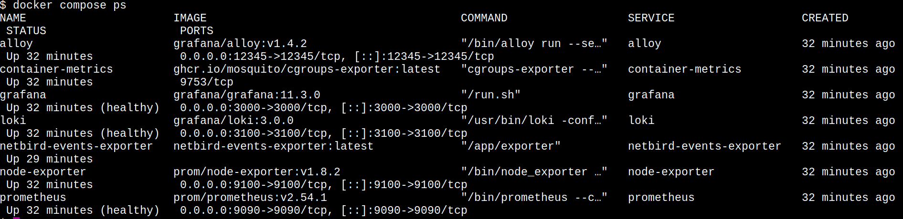
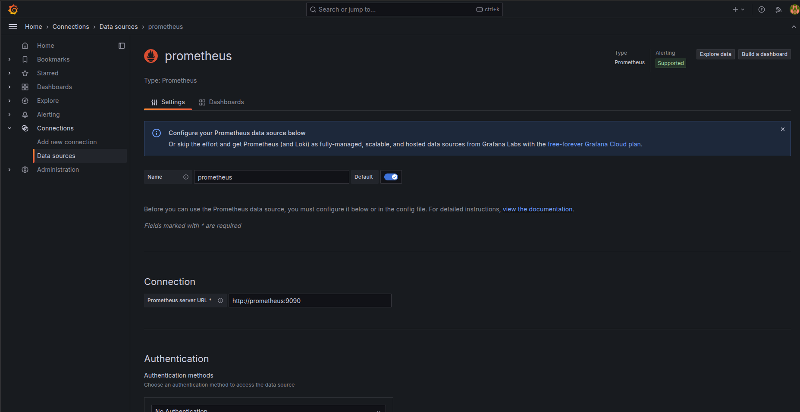
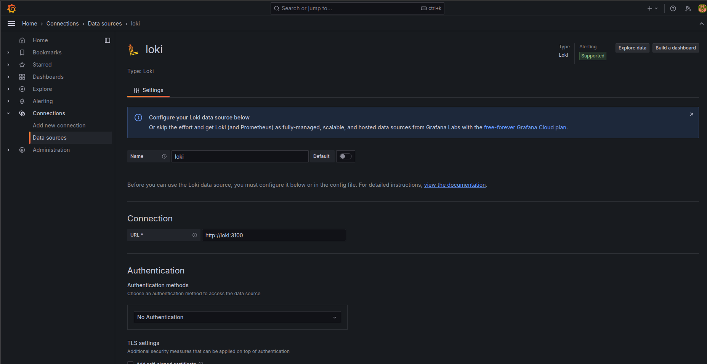

# Manual LGTM Stack Deployment

This guide explains how to manually deploy an observability stack.

## 1. Deployment Constraints

This deployment expects an external Docker network named `netbird_netbird` to exist. This is typically created by the NetBird management stack.

> **Note**: If you do not have NetBird running, you must create this network manually to avoid errors:

```bash
docker network create netbird_netbird
```

## 2. Deploying the Stack

1. Navigate to the manual configuration directory:

    ```bash
    cd ../lgtm-stack/manual
    ```

2. Start the services in detached mode:

    ```bash
    docker compose up -d
    ```

This will spin up the following containers:

* `loki` (Logs)
* `prometheus` (Metrics)
* `grafana` (Visualization)
* `alloy` (Collector)
* `node-exporter` & `container-metrics` (Host monitoring)

## 3. Verifying the Deployment ("Pods")

To check the status of your containers (often referred to as pods in Kubernetes contexts), run:

```bash
docker compose ps
```

You should see all services with a status of `Up` (and `healthy` where applicable).



## 4. Accessing Grafana

* **URL**: `http://localhost:3000` (or your server's IP address)
* **Default Credentials**:
  * User: `admin`
  * Password: `admin`

## 5. Verifying Data Sources

Once logged into Grafana, you should verify that it can connect to Prometheus and Loki.

### 5.1 Verify Prometheus

1. Navigate to **Connections** > **Data Sources**.
2. Click on **Prometheus**.
3. Scroll to the bottom and click **Save & test**.
4. You should see a green message: *“Successfully queried the Prometheus API.”*



### 5.2 Verify Loki

1. Navigate to **Connections** > **Data Sources**.
2. Click on **Loki**.
3. Scroll to the bottom and click **Save & test**.
4. You should see a green message indicating the data source is connected.



## 6. Cleanup

To stop and remove the stack:

```bash
docker compose down
```

## 7. Troubleshooting

### Network Not Found Error
```bash
# Fix: Create missing network
docker network create netbird_netbird
```

### Port Conflicts
```bash
# Check what is using port 3000
lsof -i :3000

# Fix: Stop conflicting service or change port mapping in docker-compose.yml
```

### Container Exits Immediately
```bash
# Check crash logs
docker compose logs <service_name>

# Fix: Common issue is permission on mounted volumes (chown -R 10001:10001)
```
