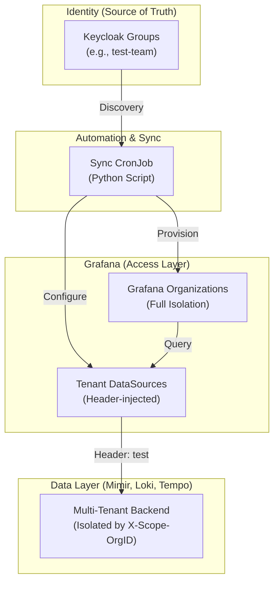

# LGTM Multi-Tenancy Architecture

This document describes how the LGTM (Loki, Grafana, Tempo, Mimir) stack implements **Isolation, Identity, and Automation** to support multiple independent tenants on a shared platform.

---

## Core Architecture Overview

Our architecture follows a "shared-service, separate-storage" model. While the core monitoring components (Loki, Mimir, etc.) are shared, data is logically isolated using a **Tenant ID** (OrgID) that is enforced at every layer.

---

## The Three Pillars of Isolation

### 1. Data Isolation (The "OrgID" Header)
Loki, Mimir, and Tempo are configured with `multitenancy_enabled: true`. This turns on a mandatory HTTP header: `X-Scope-OrgID`.

- **Loki (Logs)**: Isolates logs into separate chunks and indexes per tenant. Enforced at the Gateway level (Nginx).
- **Mimir (Metrics)**: Ensures Prometheus samples are stored in tenant-specific blocks. No data leakage between tenants at the querier level.
- **Tempo (Traces)**: Traces are partitioned in the backend storage (GCS/S3) by OrgID.
- **At Write/Query Time**: All interaction requires the `X-Scope-OrgID` header.

### 2. Identity Isolation (Keycloak Integration)
We use Keycloak as our SSO provider. Tenant membership is defined by **Keycloak Groups**.

- Any group ending in `-team` (e.g., `test-team`) is automatically discovered.
- When a user logs in via OIDC, Grafana receives their group memberships in the JWT `groups` claim.
- **User Sync**: The system ensures users belong ONLY to their assigned tenant organizations and teams in Grafana.

### 3. Visual Isolation (Grafana Organizations & Teams)
Grafana is the "Lens" through which users see data. We use **Organizations** to ensure users only see their own lens.

- **Organizations**: Every tenant gets a dedicated Grafana Organization. This is the strongest form of isolation in Grafana OSS.
- **Teams**: Inside each organization, a team is created for more granular permissioning if needed.
- **Permissions**:
    - **DataSources**: The "Test-Loki" datasource is only accessible within the "test-team" organization.
    - **Folders**: Dashboards for a tenant live in a folder accessible only by that tenant's organization.
    - **Isolation**: Users from one tenant cannot even see the existence of other tenants' datasources or folders because they are in separate organizations.

---

## Automation: The `grafana-team-sync` Job

To eliminate manual configuration, a Python-based **CronJob** runs every 5 minutes in the cluster. It performs the following "Zero-Touch" provisioning:

1.  **Discovery**: Scans Keycloak for all groups ending in `-team`.
2.  **Organization & Team Provisioning**: Creates a matching Organization and Team in Grafana if they don't exist.
3.  **DataSource Provisioning**: Automatically creates Loki, Mimir, Tempo, and Prometheus datasources for each tenant, pre-configured with the correct `X-Scope-OrgID`.
4.  **Folder Provisioning**: Creates a dedicated Dashboard Folder for the tenant.
5.  **Access Control**: Grants the newly created Team "Viewer" or "Editor" permissions to their specific Folder and DataSources.
6.  **Auth Bridging**: Generates an `.htpasswd` entry for the **Loki Gateway**, allowing Basic Auth for log-shippers (like Alloy) using the same tenant name.

---

## How to Add a New Tenant

Because of the automation, adding a tenant is a purely "Identity" action:

1.  **In Keycloak**: Create a new group called `mytenant-team`.
2.  **Assign Users**: Add the desired users to this group.
3.  **Wait**: Within 5 minutes, the sync job will have provisioned the `Mytenant-team` organization in Grafana, along with `Mytenant-Loki` and the `Mytenant Dashboards` folder.
4.  **Login**: Users can now log in to Grafana and will automatically land in their tenant's organization.

---

## Security Note: The Gateway Layer
All log ingestion traffic passes through an **NGINX Gateway** that enforces:
- **Authentication**: Basic Auth against the dynamically synced `.htpasswd`.
- **Tenant Validation**: Ensuring the `X-Scope-OrgID` matches the authenticated user.
- **Rate Limiting**: Potential to apply per-tenant limits (configuration dependent).
