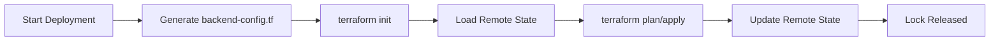

# Terraform State Management Guide

Complete guide to managing Terraform state files for the observability infrastructure across all cloud providers.

##  Table of Contents

- [Overview](#overview)
- [State Storage Architecture](#state-storage-architecture)
- [How State Management Works](#how-state-management-works)
- [Backend Configuration Script](#backend-configuration-script)
- [Using Existing Buckets](#using-existing-buckets)
- [State File Organization](#state-file-organization)
- [Team Collaboration](#team-collaboration)
- [Best Practices](#best-practices)
- [Troubleshooting](#troubleshooting)

---

## Overview

Terraform state files are critical for infrastructure management. They:
- Track all deployed resources
- Enable Terraform to know what exists
- Prevent duplicate resource creation
- Support team collaboration
- Enable rollback capabilities

**Key Principle:** State files are stored remotely in cloud storage buckets and **NEVER deleted** between runs.

---

## State Storage Architecture

### Storage Backends by Provider

| Provider | Backend Type | State Storage | Locking Mechanism |
|----------|--------------|---------------|-------------------|
| **GKE** | Google Cloud Storage (GCS) | gs://bucket/terraform/component/ | Native GCS locking |
| **EKS** | Amazon S3 | s3://bucket/terraform/component/ | DynamoDB table |
| **AKS** | Azure Blob Storage | account/container/terraform/component/ | Native Blob locking |

### State File Locations

```
Component-based organization:

gs://my-bucket/terraform/
├── cert-manager/
│   └── default.tfstate
├── ingress-controller/
│   └── default.tfstate
├── lgtm-stack/
│   └── default.tfstate
├── argocd-agent-hub/
│   └── default.tfstate
└── argocd-agent-spoke-cluster1/
    └── default.tfstate
```

---

## How State Management Works

### Workflow Overview



### What Happens During Each Run

1. **Backend Config Generation** (Lines 113-119 in workflows)
   ```yaml
   - name: Cleanup old backend configs
     run: |
       # Remove only backend config files (NOT state files)
       # State files remain safely in GCS bucket across all runs
       rm -f backend.tf backend-config.tf
   
   - name: Configure backend
     run: |
       bash configure-backend.sh gke cert-manager
     env:
       TF_STATE_BUCKET: ${{ secrets.TF_STATE_BUCKET }}
   ```

2. **State Loading**
   - `terraform init` connects to remote backend
   - Downloads current state file
   - Applies state locking

3. **State Updates**
   - `terraform apply` modifies infrastructure
   - Updates state file in remote storage
   - Releases lock after completion

### Critical Understanding

**What Gets Cleaned:**
-  `backend-config.tf` (regenerated each run)
-  `backend.tf` (if exists, regenerated)
-  Local `.terraform/` directory (recreated by init)

**What NEVER Gets Cleaned:**
-  Remote state files in buckets
-  State history (versioning enabled)
-  Lock tables

---

## Backend Configuration Script

### Script Location

```
.github/scripts/configure-backend.sh
```

### Usage

```bash
bash configure-backend.sh <provider> <component>
```

**Parameters:**
- `provider`: gke, eks, aks, or generic
- `component`: cert-manager, ingress-controller, lgtm-stack, argocd-agent-hub, etc.

### Environment Variables

**GKE:**
```bash
export TF_STATE_BUCKET="my-gcs-bucket"
bash configure-backend.sh gke cert-manager
```

**EKS:**
```bash
export TF_STATE_BUCKET="my-s3-bucket"
export AWS_REGION="us-east-1"
export TF_STATE_LOCK_TABLE="terraform-state-lock"  # Optional, defaults to terraform-state-lock
bash configure-backend.sh eks cert-manager
```

**AKS:**
```bash
export AZURE_STORAGE_ACCOUNT="mystorageaccount"
export AZURE_STORAGE_CONTAINER="terraform-state"
bash configure-backend.sh aks cert-manager
```

### Generated Backend Configuration

**GKE Example:**
```hcl
# Auto-generated backend configuration for GCS
# State files are stored at: gs://my-bucket/terraform/cert-manager/
terraform {
  backend "gcs" {
    bucket = "my-bucket"
    prefix = "terraform/cert-manager"
  }
}
```

**EKS Example:**
```hcl
# Auto-generated backend configuration for S3
# State files are stored at: s3://my-bucket/terraform/cert-manager/
terraform {
  backend "s3" {
    bucket         = "my-bucket"
    key            = "terraform/cert-manager/terraform.tfstate"
    region         = "us-east-1"
    encrypt        = true
    dynamodb_table = "terraform-state-lock"
  }
}
```

---

## Setting Up State Storage

### Creating New State Storage

If you don't have existing state storage, create it using the instructions below:

#### GKE - Create GCS Bucket

```bash
# Set variables
export PROJECT_ID="your-gcp-project-id"
export BUCKET_NAME="terraform-state-$(date +%s)"
export REGION="us-central1"

# Create bucket
gcloud storage buckets create gs://${BUCKET_NAME} \
  --project=${PROJECT_ID} \
  --location=${REGION} \
  --uniform-bucket-level-access

# Enable versioning
gcloud storage buckets update gs://${BUCKET_NAME} \
  --versioning

# Create service account (if needed)
gcloud iam service-accounts create terraform-deployer \
  --display-name="Terraform Deployer" \
  --project=${PROJECT_ID}

# Grant bucket access
gcloud storage buckets add-iam-policy-binding gs://${BUCKET_NAME} \
  --member="serviceAccount:terraform-deployer@${PROJECT_ID}.iam.gserviceaccount.com" \
  --role="roles/storage.admin"

# Grant Kubernetes permissions
gcloud projects add-iam-policy-binding ${PROJECT_ID} \
  --member="serviceAccount:terraform-deployer@${PROJECT_ID}.iam.gserviceaccount.com" \
  --role="roles/container.developer"

# Create and download key
gcloud iam service-accounts keys create terraform-deployer-key.json \
  --iam-account=terraform-deployer@${PROJECT_ID}.iam.gserviceaccount.com

# Verify
gcloud storage ls gs://${BUCKET_NAME}
```

#### EKS - Create S3 Bucket and DynamoDB Table

```bash
# Set variables
export BUCKET_NAME="terraform-state-$(date +%s)"
export AWS_REGION="us-east-1"

# Create S3 bucket
aws s3api create-bucket \
  --bucket ${BUCKET_NAME} \
  --region ${AWS_REGION}

# Enable versioning
aws s3api put-bucket-versioning \
  --bucket ${BUCKET_NAME} \
  --versioning-configuration Status=Enabled

# Enable encryption
aws s3api put-bucket-encryption \
  --bucket ${BUCKET_NAME} \
  --server-side-encryption-configuration '{
    "Rules": [{
      "ApplyServerSideEncryptionByDefault": {
        "SSEAlgorithm": "AES256"
      }
    }]
  }'

# Create DynamoDB table for state locking
aws dynamodb create-table \
  --table-name terraform-state-lock \
  --attribute-definitions AttributeName=LockID,AttributeType=S \
  --key-schema AttributeName=LockID,KeyType=HASH \
  --billing-mode PAY_PER_REQUEST \
  --region ${AWS_REGION}

# Verify
aws s3 ls s3://${BUCKET_NAME}
aws dynamodb describe-table --table-name terraform-state-lock --region ${AWS_REGION}
```

#### AKS - Create Storage Account and Container

```bash
# Set variables
export RESOURCE_GROUP="rg-terraform-state"
export STORAGE_ACCOUNT="tfstate$(date +%s | cut -c 5-13)"
export CONTAINER_NAME="terraform-state"
export LOCATION="eastus"

# Create resource group
az group create \
  --name ${RESOURCE_GROUP} \
  --location ${LOCATION}

# Create storage account
az storage account create \
  --name ${STORAGE_ACCOUNT} \
  --resource-group ${RESOURCE_GROUP} \
  --location ${LOCATION} \
  --sku Standard_LRS \
  --encryption-services blob \
  --https-only true \
  --min-tls-version TLS1_2

# Create container
az storage container create \
  --name ${CONTAINER_NAME} \
  --account-name ${STORAGE_ACCOUNT}

# Enable versioning
az storage account blob-service-properties update \
  --account-name ${STORAGE_ACCOUNT} \
  --enable-versioning true

# Verify
az storage container list --account-name ${STORAGE_ACCOUNT}
```

---

## Using Existing Buckets

### Scenario: Team Already Has State Bucket

Your team likely already has a Terraform state bucket. You can easily configure our infrastructure to use it:

### For GKE

```bash
# 1. Grant access to your service account
gcloud storage buckets add-iam-policy-binding gs://EXISTING_BUCKET \
  --member="serviceAccount:your-sa@project.iam.gserviceaccount.com" \
  --role="roles/storage.admin"

# 2. Configure backend for each component
cd cert-manager/terraform
export TF_STATE_BUCKET="EXISTING_BUCKET"
bash ../../.github/scripts/configure-backend.sh gke cert-manager

cd ../../ingress-controller/terraform
bash ../../.github/scripts/configure-backend.sh gke ingress-controller

# 3. Update GitHub Secret
# Go to Settings → Secrets → Update TF_STATE_BUCKET
```

### For EKS

```bash
# 1. Ensure IAM permissions on existing bucket
# Your IAM user/role needs s3:GetObject, s3:PutObject, s3:ListBucket

# 2. Configure backend
export TF_STATE_BUCKET="EXISTING_BUCKET"
export AWS_REGION="us-east-1"
export TF_STATE_LOCK_TABLE="EXISTING_LOCK_TABLE"

cd cert-manager/terraform
bash ../../.github/scripts/configure-backend.sh eks cert-manager

# 3. Update GitHub Secrets
# TF_STATE_BUCKET=EXISTING_BUCKET
# TF_STATE_LOCK_TABLE=EXISTING_LOCK_TABLE
```

### For AKS

```bash
# 1. Grant access to service principal
az role assignment create \
  --assignee YOUR_SP \
  --role "Storage Blob Data Contributor" \
  --scope /subscriptions/SUB/resourceGroups/RG/providers/Microsoft.Storage/storageAccounts/EXISTING_ACCOUNT

# 2. Configure backend
export AZURE_STORAGE_ACCOUNT="EXISTING_ACCOUNT"
export AZURE_STORAGE_CONTAINER="EXISTING_CONTAINER"

cd cert-manager/terraform
bash ../../.github/scripts/configure-backend.sh aks cert-manager

# 3. Update GitHub Secrets
# AZURE_STORAGE_ACCOUNT=EXISTING_ACCOUNT
# AZURE_STORAGE_CONTAINER=EXISTING_CONTAINER
```

---

## State File Organization

### Component Isolation

Each component has its own state file to prevent conflicts:

```
gs://shared-bucket/terraform/
├── cert-manager/           # State for cert-manager
├── ingress-controller/     # State for ingress-controller
├── lgtm-stack/            # State for LGTM components
├── argocd-agent-hub/      # State for ArgoCD hub
└── argocd-agent-spoke-1/  # State for ArgoCD spoke-1
```

### Benefits

 **Isolation**: Changes to one component don't affect others  
 **Parallel Deployments**: Multiple components can deploy simultaneously  
 **Blast Radius Control**: Errors limited to single component  
 **State File Size**: Smaller, more manageable files  

---

## Team Collaboration

### How Multiple Developers Collaborate

1. **Shared State Bucket**
   - All team members use same bucket
   - GitHub Actions also uses same bucket
   - Everyone sees same infrastructure state

2. **State Locking**
   - Prevents simultaneous modifications
   - First person to run `terraform apply` gets lock
   - Others must wait until lock is released

3. **State Versioning**
   - Previous state versions saved automatically
   - Can rollback if needed
   - History of all infrastructure changes

### Example: Two Developers

```
Developer A:                    Developer B:
terraform plan                  terraform plan
terraform apply                 terraform apply
  ↓ (acquires lock)               ↓ (waits for lock)
  Changes infrastructure          Lock unavailable
  Updates state                   Waits...
  Releases lock                   Waits...
                                  ↓ (acquires lock)
                                  Sees A's changes
                                  Makes additional changes
                                  Releases lock
```

### GitHub Actions Integration

```yaml
# Workflow automatically uses same state bucket
env:
  TF_STATE_BUCKET: ${{ secrets.TF_STATE_BUCKET }}

# Multiple workflow runs coordinate via state locking
# No manual coordination needed
```

---

## Best Practices

### 1. Enable State File Versioning

**GKE:**
```bash
gcloud storage buckets update gs://your-bucket --versioning
```

**EKS:**
```bash
aws s3api put-bucket-versioning \
  --bucket your-bucket \
  --versioning-configuration Status=Enabled
```

**AKS:**
```bash
az storage account blob-service-properties update \
  --account-name your-account \
  --enable-versioning true
```

### 2. Use Separate Buckets/Folders per Environment

```
Production:
  gs://prod-terraform-state/terraform/cert-manager/

Staging:
  gs://staging-terraform-state/terraform/cert-manager/

Development:
  gs://dev-terraform-state/terraform/cert-manager/
```

### 3. Restrict Bucket Access

```bash
# GKE - Only specific service accounts
gcloud storage buckets add-iam-policy-binding gs://bucket \
  --member="serviceAccount:terraform@project.iam.gserviceaccount.com" \
  --role="roles/storage.admin"

# Don't grant allUsers or allAuthenticatedUsers
```

### 4. Monitor State File Changes

```bash
# GKE - View state file versions
gcloud storage ls -L gs://bucket/terraform/cert-manager/

# EKS - List versions
aws s3api list-object-versions --bucket bucket --prefix terraform/cert-manager/
```

### 5. Backup State Files

While versioning provides protection, consider additional backups:

```bash
# GKE - Copy to backup bucket
gcloud storage cp gs://prod-bucket/terraform/ gs://backup-bucket/terraform/ --recursive

# EKS - Replicate to another region
aws s3 sync s3://prod-bucket/terraform/ s3://backup-bucket/terraform/
```

### 6. Never Manually Edit State Files

-  Don't edit state JSON directly
-  Use `terraform state` commands:
  ```bash
  terraform state list
  terraform state show <resource>
  terraform state mv <source> <destination>
  terraform state rm <resource>
  ```

### 7. Add backend-config.tf to .gitignore

```bash
# In each component directory
echo "backend-config.tf" >> .gitignore
echo "terraform.tfstate*" >> .gitignore
echo ".terraform/" >> .gitignore
```

---

## Troubleshooting

### Issue: "Error acquiring the state lock"

**Cause:** Another user/process is running Terraform.

**Solution 1 - Wait:**
```bash
# Wait for other process to complete
# Locks are released automatically after apply/destroy
```

**Solution 2 - Force Unlock (EKS):**
```bash
# Check lock table
aws dynamodb get-item \
  --table-name terraform-state-lock \
  --key '{"LockID": {"S": "bucket/terraform/cert-manager/terraform.tfstate-md5"}}'

# Force unlock (use carefully!)
terraform force-unlock <LOCK_ID>
```

**Solution 3 - Force Unlock (GKE/AKS):**
```bash
# Locks are managed automatically
# Usually just need to wait for timeout
terraform force-unlock <LOCK_ID>
```

### Issue: "Backend configuration changed"

**Cause:** Backend settings were modified.

**Solution:**
```bash
# Migrate to new backend
terraform init -migrate-state

# Or reconfigure
terraform init -reconfigure
```

### Issue: "State file not found"

**Cause:** First deployment or state file deleted.

**Solution for First Deployment:**
```bash
# This is normal for first run
terraform init
terraform plan
terraform apply
```

**Solution for Deleted State:**
```bash
# Option 1: Restore from version history (GKE)
gcloud storage cp gs://bucket/terraform/cert-manager/default.tfstate#<version> \
  gs://bucket/terraform/cert-manager/default.tfstate

# Option 2: Import existing resources
terraform import <resource_type>.<name> <resource_id>

# Example:
terraform import kubernetes_namespace.cert_manager cert-manager
```

### Issue: "Permission denied" accessing bucket

**Cause:** Insufficient IAM permissions.

**Solution (GKE):**
```bash
gcloud storage buckets add-iam-policy-binding gs://bucket \
  --member="serviceAccount:your-sa@project.iam.gserviceaccount.com" \
  --role="roles/storage.admin"
```

**Solution (EKS):**
```bash
# Attach policy granting S3 and DynamoDB access
aws iam attach-user-policy \
  --user-name terraform-user \
  --policy-arn arn:aws:iam::ACCOUNT:policy/TerraformStateAccess
```

**Solution (AKS):**
```bash
az role assignment create \
  --assignee YOUR_SP \
  --role "Storage Blob Data Contributor" \
  --scope /subscriptions/SUB/resourceGroups/RG/providers/Microsoft.Storage/storageAccounts/ACCOUNT
```

### Issue: "resource already exists"

**Cause:** State file out of sync with actual infrastructure.

**Solution 1 - Refresh State:**
```bash
terraform refresh
terraform plan
```

**Solution 2 - Import Resource:**
```bash
# Find resource ID
kubectl get <resource> -n <namespace>

# Import into state
terraform import <resource_type>.<name> <resource_id>
```

**Solution 3 - Remove from State:**
```bash
# If resource shouldn't be managed by Terraform
terraform state rm <resource_type>.<name>
```

---

## Summary

 **State files are stored remotely** in cloud provider buckets  
 **State files NEVER get deleted** between runs  
 **Only backend-config.tf is regenerated** for each deployment  
 **State locking prevents** concurrent modifications  
 **Versioning enabled** for rollback capabilities  
 **Team collaboration** via shared state buckets  
 **Component isolation** prevents cross-component conflicts  

## Component-Specific Documentation

Each component has detailed deployment setup documentation:

- [cert-manager Setup](../cert-manager/DEPLOYMENT_SETUP.md)
- [ingress-controller Setup](../ingress-controller/DEPLOYMENT_SETUP.md)
- [lgtm-stack Setup](../lgtm-stack/DEPLOYMENT_SETUP.md)
- [argocd-agent Setup](../argocd-agent/DEPLOYMENT_SETUP.md)

---

**Questions?** Open an issue or contact the DevOps team.
