# Grafana Observability Stack Testing Documentation

## Project: <PROJECT_ID> - GKE Deployment

## Table of Contents

1. [Overview](#overview)
2. [Architecture](#architecture)
3. [Prerequisites](#prerequisites)
4. [Pre-Testing Health Checks](#pre-testing-health-checks)
5. [Component Testing](#component-testing)
6. [Remote Testing](#remote-testing)

---
<a id="overview"></a>

## 1. Overview

### 1.1 Purpose

This documentation provides comprehensive testing procedures for the Grafana observability stack deployed on GKE cluster `<PROJECT_ID>`. The testing ensures all components are functioning correctly.

### 1.2 Stack Components

- **Grafana**: Dashboard and visualization
- **Loki**: Log aggregation and storage
- **Mimir**: Long-term metrics storage (Prometheus-compatible)
- **Tempo**: Distributed tracing backend
- **Prometheus**: Metrics collection and scraping
- **Alloy**: Unified telemetry collector

---

<a id="architecture"></a>

## 2. Architecture

### 2.1 Component Flow Diagram

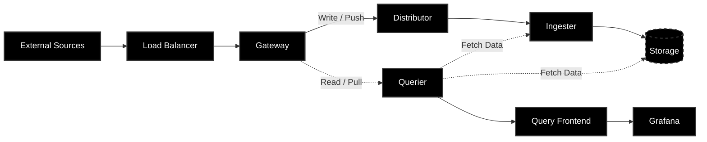

### 2.2 Service Endpoints

| Component | Internal Service | Port | Type |
|-----------|-----------------|------|------|
| Grafana | monitoring-grafana | 80 | ClusterIP |
| Loki Gateway | monitoring-loki-gateway | 80 | ClusterIP |
| Mimir NGINX | monitoring-mimir-nginx | 80 | ClusterIP |
| Tempo Gateway | monitoring-tempo-gateway | 3200 | ClusterIP |
| Prometheus | monitoring-prometheus-server | 80 | ClusterIP |

---

<a id="prerequisites"></a>

## 3. Prerequisites

### 3.1 Required Tools Installation

- [Kubectl (Kubernetes CLI)](https://kubernetes.io/docs/tasks/tools/install-kubectl-linux/)
- [Helm (Package Manager)](https://helm.sh/docs/intro/install/)
- [JQ (JSON Processor)](https://lindevs.com/install-jq-on-ubuntu)
- [LogCLI (Loki CLI)](https://grafana.com/docs/loki/latest/query/logcli/getting-started/)
- [Grafana Alloy (Collector)](https://grafana.com/docs/alloy/latest/set-up/install/linux/)

### 3.2 GKE Cluster Access

```bash
# Authenticate with GCP
gcloud auth login

# Set project
gcloud config set project <PROJECT_ID>

# Get cluster credentials
gcloud container clusters get-credentials <cluster-name> \
  --zone=<zone> \
  --project=<PROJECT_ID>

# Verify access
kubectl get nodes
kubectl get namespaces
kubectl get pods -n <NAMESPACE>
```

### 3.3 Access Credentials

```bash
# Get Grafana admin password
export GRAFANA_PASSWORD=$(kubectl get secret -n <NAMESPACE> \
  monitoring-grafana -o jsonpath="{.data.admin-password}" | base64 --decode)
echo "Grafana Password: $GRAFANA_PASSWORD"

# Store for later use
echo "export GRAFANA_PASSWORD='$GRAFANA_PASSWORD'" >> ~/.bashrc
source ~/.bashrc
```

---

<a id="pre-testing-health-checks"></a>

## 4. Pre-Testing Health Checks

### 4.1 Comprehensive Health Check

```bash
# Check all pod statuses
kubectl get pods -n <NAMESPACE> -o wide

# Identify any unhealthy pods
kubectl get pods -n <NAMESPACE> --field-selector=status.phase!=Running

# Check pod events
kubectl get events -n <NAMESPACE> --sort-by='.lastTimestamp' | tail -20

# Verify all services have endpoints
kubectl get endpoints -n <NAMESPACE>

# Check resource usage
kubectl top nodes
kubectl top pods -n <NAMESPACE> --sort-by=memory
```

### 4.2 Service Connectivity Test

```bash
# To view services
kubectl get svc -n <NAMESPACE> 
# Test internal DNS resolution
kubectl run -n <NAMESPACE>  dns-test --image=busybox:1.28 \
  --rm -it --restart=Never -- \
  nslookup <SERVICE_NAME>

# Test all major endpoints
## 1. Test Loki Gateway (Needs /loki prefix usually)
kubectl run -n <NAMESPACE> test-loki --image=curlimages/curl -it --rm --restart=Never -- \
  curl -v --max-time 5 "http://<LOKI_GATAWAY_SERVICE_NAME>/loki/ready"

## 2. Test Mimir Gateway (Mimics Prometheus API)
kubectl run -n <NAMESPACE> test-mimir --image=curlimages/curl -it --rm --restart=Never -- \
  curl -v --max-time 5 "http://<MIMIR_GATAWAY_SERVICE_NAME>/api/v1/status/buildinfo"

## 3. Test Tempo Gateway (Often requires /status or is restricted)
kubectl run -n <NAMESPACE> test-tempo --image=curlimages/curl -it --rm --restart=Never -- \
  curl -v --max-time 5 "http://<TEMPO_GATAWAY_SERVICE_NAME>/ready"
```

### 4.3 Storage Health

```bash
# Check PVC status
kubectl get pvc -n <NAMESPACE>

# Verify all are Bound
kubectl get pvc -n <NAMESPACE> -o wide | grep -v Bound || echo "All PVCs are Bound"
# Check disk usage on ingesters
kubectl exec -n <NAMESPACE> <PVC_NAME> -- df -h

```

---

<a id="component-testing"></a>

## 5. Component Testing(still on cluster)

### 5.1 Deploy Test Generators

Create all-generators.yaml file

```bash
# =========================================================
# LOG GENERATORS
# =========================================================
apiVersion: apps/v1
kind: Deployment
metadata:
  name: log-generator
  namespace: test-apps
  labels:
    app: log-generator
spec:
  replicas: 3
  selector:
    matchLabels:
      app: log-generator
  template:
    metadata:
      labels:
        app: log-generator
    spec:
      containers:
      - name: json-logs
        image: mingrammer/flog:0.4.3
        args:
          - --loop
          - --format=json
          - --number=10
          - --delay=1s
        resources:
          requests:
            memory: "64Mi"
            cpu: "100m"
          limits:
            memory: "128Mi"
            cpu: "200m"
      - name: structured-logs
        image: busybox:1.28
        command: ["/bin/sh"]
        args:
          - -c
          - |
            while true; do
              echo "$(date -u +%Y-%m-%dT%H:%M:%SZ) level=info msg=\"Application started\" service=api version=1.0.0"
              sleep 2
              echo "$(date -u +%Y-%m-%dT%H:%M:%SZ) level=warn msg=\"High memory usage\" memory_percent=85 threshold=80"
              sleep 3
              echo "$(date -u +%Y-%m-%dT%H:%M:%SZ) level=error msg=\"Database connection failed\" error=\"timeout after 30s\" retry_count=3"
              sleep 2
              echo "$(date -u +%Y-%m-%dT%H:%M:%SZ) level=debug msg=\"Cache hit\" key=user:12345 hit_rate=92.5"
              sleep 3
            done
        resources:
          requests:
            memory: "32Mi"
            cpu: "50m"
---
apiVersion: apps/v1
kind: Deployment
metadata:
  name: error-simulator
  namespace: test-apps
  labels:
    app: error-simulator
spec:
  replicas: 2
  selector:
    matchLabels:
      app: error-simulator
  template:
    metadata:
      labels:
        app: error-simulator
    spec:
      containers:
      - name: error-generator
        image: busybox:1.28
        command: ["/bin/sh"]
        args:
          - -c
          - |
            while true; do
              echo "ERROR: Out of memory exception in thread main"
              sleep 5
              echo "FATAL: Unable to connect to database: connection refused"
              sleep 7
              echo "ERROR: HTTP 500 Internal Server Error on /api/users"
              sleep 4
              echo "CRITICAL: Disk usage exceeded 95% on /data"
              sleep 6
            done
        resources:
          requests:
            memory: "32Mi"
            cpu: "50m"
---
# =========================================================
# METRICS GENERATORS
# =========================================================
apiVersion: apps/v1
kind: Deployment
metadata:
  name: metrics-generator
  namespace: test-apps
  labels:
    app: metrics-generator
spec:
  replicas: 3
  selector:
    matchLabels:
      app: metrics-generator
  template:
    metadata:
      labels:
        app: metrics-generator
      annotations:
        prometheus.io/scrape: "true"
        prometheus.io/port: "8080"
        prometheus.io/path: "/metrics"
    spec:
      containers:
      - name: prometheus-example-app
        image: quay.io/brancz/prometheus-example-app:v0.3.0
        ports:
        - containerPort: 8080
          name: metrics
        resources:
          requests:
            memory: "64Mi"
            cpu: "100m"
          limits:
            memory: "128Mi"
            cpu: "200m"
        livenessProbe:
          httpGet:
            path: /
            port: 8080
          initialDelaySeconds: 5
          periodSeconds: 10
---
apiVersion: v1
kind: Service
metadata:
  name: metrics-generator
  namespace: test-apps
  labels:
    app: metrics-generator
spec:
  selector:
    app: metrics-generator
  ports:
  - port: 8080
    targetPort: 8080
    name: metrics
---
apiVersion: monitoring.coreos.com/v1
kind: ServiceMonitor
metadata:
  name: metrics-generator-monitor
  namespace: test-apps
  labels:
    app: metrics-generator
    release: monitoring
spec:
  namespaceSelector:
    matchNames:
    - test-apps
  selector:
    matchLabels:
      app: metrics-generator
  endpoints:
  - port: metrics
    interval: 30s
    path: /metrics
---
# =========================================================
# TRACE GENERATORS
# =========================================================
apiVersion: apps/v1
kind: Deployment
metadata:
  name: trace-generator
  namespace: test-apps
  labels:
    app: trace-generator
spec:
  replicas: 2
  selector:
    matchLabels:
      app: trace-generator
  template:
    metadata:
      labels:
        app: trace-generator
    spec:
      containers:
      - name: telemetrygen
        image: ghcr.io/open-telemetry/opentelemetry-collector-contrib/telemetrygen:latest
        args:
          - traces
          - --otlp-endpoint=otel-collector.test-apps.svc.cluster.local:4317
          - --otlp-insecure
          - --rate=1
          - --duration=1h
          - --workers=1
        resources:
          requests:
            memory: "64Mi"
            cpu: "50m"
          limits:
            memory: "128Mi"
            cpu: "100m"
---
apiVersion: apps/v1
kind: Deployment
metadata:
  name: microservice-simulator
  namespace: test-apps
  labels:
    app: microservice-sim
spec:
  replicas: 2
  selector:
    matchLabels:
      app: microservice-sim
  template:
    metadata:
      labels:
        app: microservice-sim
    spec:
      containers:
      - name: frontend
        image: ghcr.io/open-telemetry/opentelemetry-collector-contrib/telemetrygen:latest
        args:
          - traces
          - --otlp-endpoint=monitoring-tempo-distributor.<NAMESPACE>.svc.cluster.local:4317
          - --otlp-insecure
          - --rate=1
          - --duration=1h
          - --service=frontend-service
        resources:
          requests:
            memory: "64Mi"
            cpu: "50m"
---
# =========================================================
# ALLOY COLLECTOR (for Log scraping to Loki)
# =========================================================
apiVersion: v1
kind: ConfigMap
metadata:
  name: alloy-config
  namespace: test-apps
data:
  config.alloy: |
    logging {
      level  = "info"
      format = "json"
    }

    discovery.kubernetes "pods" {
      role = "pod"
    }

    discovery.relabel "pod_logs" {
      targets = discovery.kubernetes.pods.targets
      rule {
        source_labels = ["__meta_kubernetes_namespace"]
        target_label  = "namespace"
      }
      rule {
        source_labels = ["__meta_kubernetes_pod_name"]
        target_label  = "pod"
      }
      rule {
        source_labels = ["__meta_kubernetes_pod_label_app"]
        target_label  = "app"
      }
      rule {
        source_labels = ["__meta_kubernetes_pod_container_name"]
        target_label  = "container"
      }
    }

    loki.source.kubernetes "pod_logs" {
      targets    = discovery.relabel.pod_logs.output
      forward_to = [loki.write.default.receiver]
    }

    loki.write "default" {
      endpoint {
        url = "http://monitoring-loki-gateway.<NAMESPACE>.svc.cluster.local/loki/api/v1/push"
      }
    }
---
apiVersion: apps/v1
kind: DaemonSet
metadata:
  name: alloy-collector
  namespace: test-apps
spec:
  selector:
    matchLabels:
      app: alloy-collector
  template:
    metadata:
      labels:
        app: alloy-collector
    spec:
      serviceAccountName: alloy-collector
      containers:
      - name: alloy
        image: grafana/alloy:latest
        args:
          - run
          - /etc/alloy/config.alloy
          - --server.http.listen-addr=0.0.0.0:12345
        volumeMounts:
        - name: config
          mountPath: /etc/alloy
        - name: varlog
          mountPath: /var/log
          readOnly: true
        ports:
        - containerPort: 12345
          name: http
        resources:
          requests:
            memory: "128Mi"
            cpu: "100m"
          limits:
            memory: "256Mi"
            cpu: "200m"
      volumes:
      - name: config
        configMap:
          name: alloy-config
      - name: varlog
        hostPath:
          path: /var/log
          type: Directory
---
apiVersion: v1
kind: ServiceAccount
metadata:
  name: alloy-collector
  namespace: test-apps
---
apiVersion: rbac.authorization.k8s.io/v1
kind: ClusterRole
metadata:
  name: alloy-collector
rules:
- apiGroups: [""]
  resources:
  - nodes
  - nodes/proxy
  - pods
  - events
  verbs: ["get", "list", "watch"]
- apiGroups: [""]
  resources:
  - services
  - endpoints
  verbs: ["get", "list"]
---
apiVersion: rbac.authorization.k8s.io/v1
kind: ClusterRoleBinding
metadata:
  name: alloy-collector
roleRef:
  apiGroup: rbac.authorization.k8s.io
  kind: ClusterRole
  name: alloy-collector
subjects:
- kind: ServiceAccount
  name: alloy-collector
  namespace: test-apps
---
# =========================================================
# TEMPO OTLP RECEIVER (for Traces)
# =========================================================
apiVersion: v1
kind: ConfigMap
metadata:
  name: otel-collector-config
  namespace: test-apps
data:
  otel-collector-config.yaml: |
    receivers:
      otlp:
        protocols:
          grpc:
            endpoint: 0.0.0.0:4317
          http:
            endpoint: 0.0.0.0:4318

    exporters:
      otlp:
        endpoint: monitoring-tempo-distributor.<NAMESPACE>.svc.cluster.local:4317
        tls:
          insecure: true

    service:
      pipelines:
        traces:
          receivers: [otlp]
          exporters: [otlp]
---
apiVersion: apps/v1
kind: Deployment
metadata:
  name: otel-collector
  namespace: test-apps
  labels:
    app: otel-collector
spec:
  replicas: 1
  selector:
    matchLabels:
      app: otel-collector
  template:
    metadata:
      labels:
        app: otel-collector
    spec:
      containers:
      - name: otel-collector
        image: otel/opentelemetry-collector-contrib:latest
        args:
          - "--config=/etc/otel-collector-config.yaml"
        volumeMounts:
        - name: otel-collector-config
          mountPath: /etc/otel-collector-config.yaml
          subPath: otel-collector-config.yaml
        ports:
        - containerPort: 4317
          name: otlp-grpc
        - containerPort: 4318
          name: otlp-http
        resources:
          requests:
            memory: "256Mi"
            cpu: "200m"
          limits:
            memory: "512Mi"
            cpu: "500m"
      volumes:
      - name: otel-collector-config
        configMap:
          name: otel-collector-config
---
apiVersion: v1
kind: Service
metadata:
  name: otel-collector
  namespace: test-apps
spec:
  selector:
    app: otel-collector
  ports:
  - port: 4317
    targetPort: 4317
    name: otlp-grpc
  - port: 4318
    targetPort: 4318
    name: otlp-http
```

```bash
# Install some CRDs
helm repo update
helm install prometheus prometheus-community/kube-prometheus
kubectl apply --server-side -f https://raw.githubusercontent.com/prometheus-operator/prometheus-operator/main/example/prometheus-operator-crd-full/monitoring.coreos.com_alertmanagerconfigs.yaml --force-conflicts

# Create test-apps namespace
kubectl create namespace test-apps
# Apply all generators
kubectl apply -f all-generators.yaml -n test-apps

# Verify pods are running
kubectl get pods -n test-apps -w
kubectl wait --for=condition=ready pod -l app=log-generator -n test-apps --timeout=120s
```

#### 5.1.1 Verify Logs Are Being Generated(Loki testing)

```bash
# Check log-generator pods
kubectl logs -n test-apps -l app=log-generator -c json-logs --tail=20
kubectl logs -n test-apps -l app=log-generator -c structured-logs --tail=20
kubectl logs -n test-apps -l app=error-simulator --tail=20
```

#### 5.1.2 Query Logs via LogCLI

```bash
# Port-forward to Loki
kubectl port-forward -n <NAMESPACE> svc/monitoring-loki-gateway 3100:80 &
PF_PID=$!
sleep 3

# Export Loki address
export LOKI_ADDR=http://localhost:3100

# Test 1: Query all logs from test-apps namespace
logcli query '{namespace="test-apps"}' --limit=50 --since=5m

# Test 2: Query JSON logs only
logcli query '{app="log-generator", container="json-logs"}' --limit=20

# Test 3: Query structured logs
logcli query '{app="log-generator", container="structured-logs"}' --limit=20

# Test 4: Query error logs
logcli query '{namespace="test-apps"} |~ "(?i)error|fatal|critical"' --limit=30 --since=5m

# Test 5: Query by pod name
logcli query '{pod=~"log-generator.*"}' --limit=20

# Test 6: Query with label matching
logcli query '{app="error-simulator"}' --limit=15

# Cleanup
kill $PF_PID
```

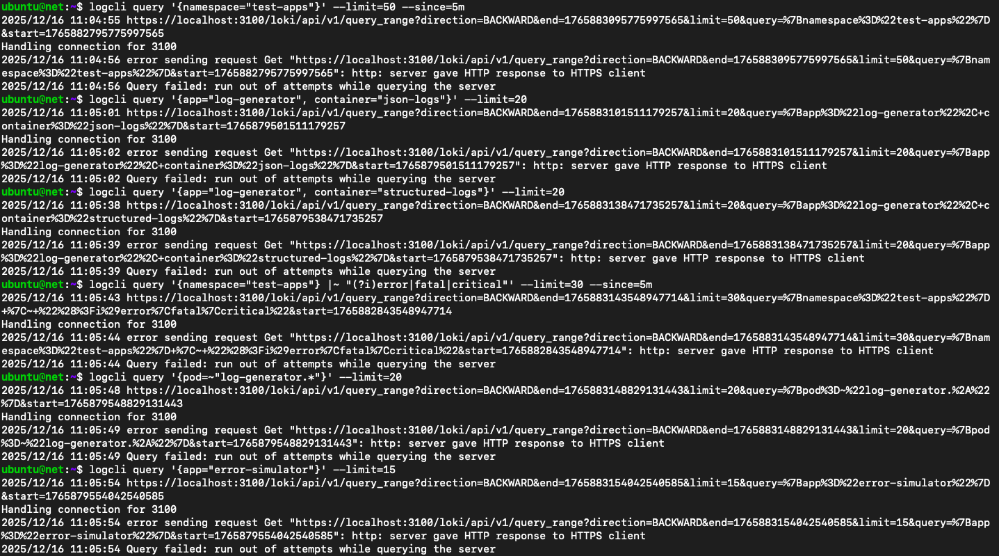

---

### 5.2 Mimir Testing (Metrics Storage)

#### 5.2.1 Verify Metrics Generator is Running

```bash
# Check metrics-generator pods
kubectl get pods -n test-apps -l app=metrics-generator

# Check if ServiceMonitor was created
kubectl get servicemonitor -n test-apps
kubectl describe servicemonitor metrics-generator-monitor -n test-apps

# Verify endpoints are registered
kubectl get endpoints -n test-apps metrics-generator
```

#### 5.2.2 Query Metrics via PromQL (Prometheus API)

```bash
# Port-forward to Prometheus
kubectl port-forward -n <NAMESPACE> svc/monitoring-prometheus-server 9090:80 &
sleep 3

# Test 1: Check if metrics are being scraped
curl -s "http://localhost:9090/api/v1/query?query=prometheus_example_app_up" | jq .

# Test 2: List all metrics from metrics-generator
curl -s "http://localhost:9090/api/v1/label/__name__/values" | jq . | grep prometheus_example

# Test 3: Query specific metrics
curl -s "http://localhost:9090/api/v1/query?query=prometheus_example_app_requests_total" | jq .

# Test 4: Query rate of requests
curl -s "http://localhost:9090/api/v1/query?query=rate(prometheus_example_app_requests_total%5B5m%5D)" | jq .

# Test 5: Check metrics count over time
curl -s "http://localhost:9090/api/v1/query_range?query=prometheus_example_app_up&start=$(date -d '30 minutes ago' +%s)&end=$(date +%s)&step=300" | jq .
```

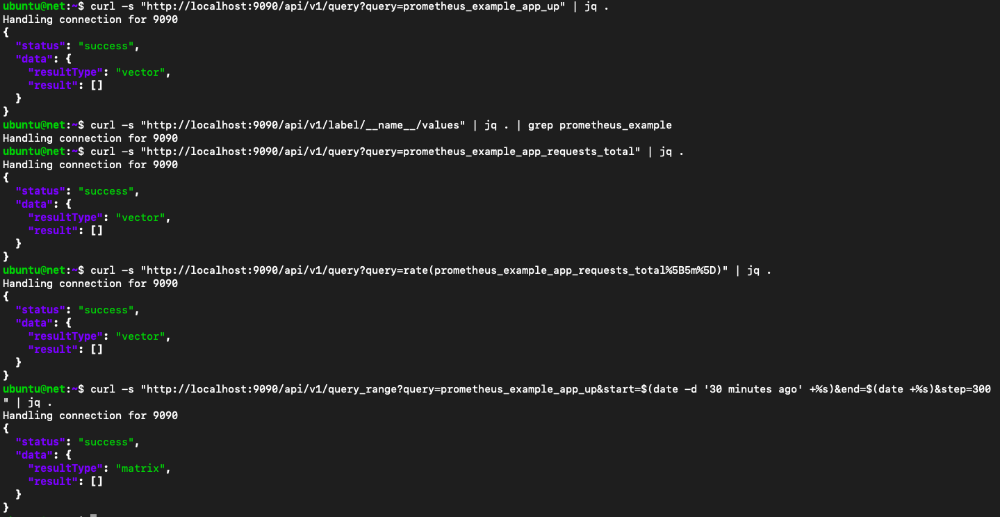

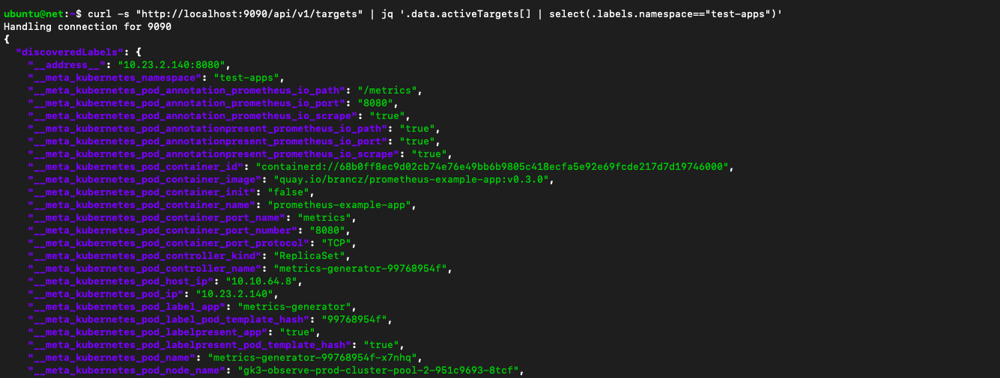

#### 5.2.3 Check Metrics in Mimir Backend

```bash
# Port-forward to Mimir NGINX gateway
kubectl port-forward -n <NAMESPACE> svc/monitoring-mimir-nginx 8081:80 &
sleep 3

# Test 1: Query metrics from Mimir directly
curl -s "http://localhost:8081/prometheus/api/v1/query?query=prometheus_example_app_up" | jq .

# Test 2: List label names
curl -s "http://localhost:8081/prometheus/api/v1/labels" | jq .

# Test 3: Check ingestion metrics
curl -s "http://localhost:8081/prometheus/api/v1/query?query=cortex_ingester_ingested_samples_total" | jq .
```

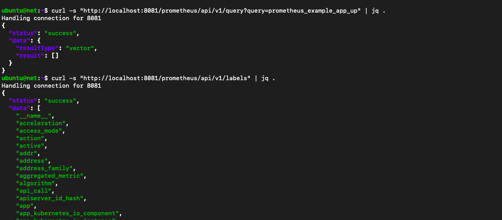

---

### 5.3 Tempo Testing (Distributed Tracing)

#### 5.3.1 Verify Trace Generators Are Running

```bash
# Check trace generators
kubectl get pods -n test-apps -l app=trace-generator
kubectl get pods -n test-apps -l app=microservice-sim

# Check OTEL collector
kubectl get pods -n test-apps -l app=otel-collector

# Verify OTEL collector service
kubectl get svc -n test-apps otel-collector
```

#### 5.3.2 Check Trace Generator Logs

```bash
# Check synthetic-load-generator logs
kubectl logs -n test-apps -l app=trace-generator -c synthetic-load --tail=30

# Check microservice-simulator logs
kubectl logs -n test-apps -l app=microservice-sim -c frontend --tail=30

# Check OTEL collector for trace ingestion
kubectl logs -n test-apps -l app=otel-collector --tail=50
```

#### 5.3.3 Query Traces via Tempo

```bash
# Port-forward to Tempo
kubectl port-forward -n <NAMESPACE> svc/monitoring-tempo-gateway 3200:80 &
sleep 3

# Test 1: Check if Tempo is receiving traces
curl -s "http://localhost:3200/api/search" | jq .

# Test 2: Query traces for synthetic-load-test service
curl -s "http://localhost:3200/api/search?service=synthetic-load-test" | jq .

# Test 3: Query traces for frontend-service
curl -s "http://localhost:3200/api/search?service=frontend-service" | jq .

# Test 4: Query by trace duration (find slow traces)
curl -s "http://localhost:3200/api/search?minDuration=100ms" | jq .

# Test 5: Get specific trace details
TRACE_ID=$(curl -s "http://localhost:3200/api/search?service=synthetic-load-test&limit=1" | jq -r '.traces[0].traceID')
curl -v "http://localhost:3200/api/search?service=synthetic-load-test&limit=1"
```

---

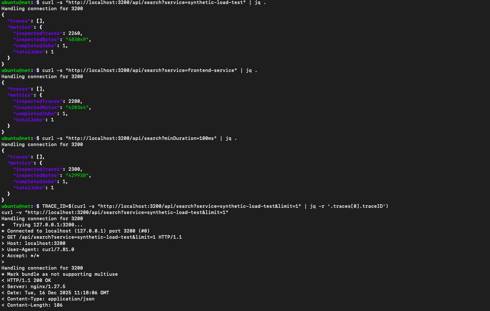

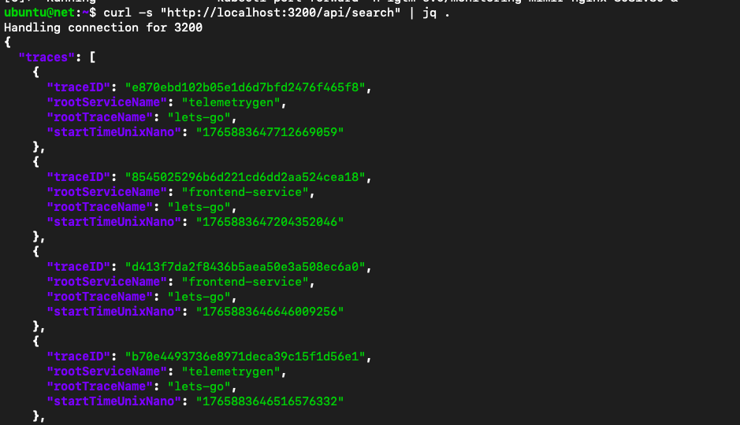

### 5.4 End-to-End Integration Testing

#### 5.4.1 Validate Data Flow (Logs → Loki → Grafana)

```bash
# Step 1: Generate logs
kubectl logs -n test-apps -l app=log-generator -c structured-logs --tail=5

# Step 2: Verify logs in Loki via LogCLI
export LOKI_ADDR=http://localhost:3100
logcli query '{app="log-generator"}' --limit=5

```

#### 5.4.2 Validate Data Flow (Metrics → Prometheus → Mimir → Grafana)

```bash
# Step 1: Check metrics are being generated
kubectl port-forward -n test-apps svc/metrics-generator 8082:8080 &
sleep 3
curl -s "http://localhost:8082/metrics" | head -20

# Step 2: Verify Prometheus scrapes them
 kubectl port-forward -n lgtm svc/monitoring-prometheus-kube-state-metrics 9091:8080 &
 sleep 3
curl -s "http://localhost:9091/api/v1/targets" | jq '.data.activeTargets[] | select(.labels.job=="test-apps/metrics-generator")'

# Step 3: Query from Mimir
kubectl port-forward -n lgtm svc/monitoring-mimir-query-frontend 8083:8080 &
sleep 3
curl -s "http://localhost:8083/prometheus/api/v1/query?query=http_requests_total" | jq .

```

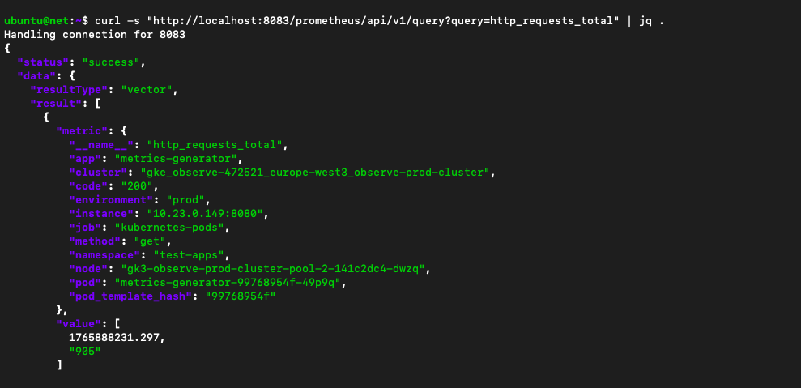

#### 5.4.3 Validate Data Flow (Traces → OTEL → Tempo → Grafana)

```bash
# Step 1: Verify OTEL collector is receiving traces
kubectl logs -n test-apps -l app=otel-collector | grep -i "span\|trace"

# Step 2: Query Tempo for traces
curl -s "http://localhost:3200/api/search?service=synthetic-load-test&limit=1" | jq '.traces[0] | {traceID, spanSet}'

```

---

#### 5.5 Validate No Errors in Collectors

```bash
# Check Alloy logs for errors
kubectl logs -n test-apps -l app=alloy-collector | grep -i "error\|warning" | tail -20

# Check OTEL collector logs for errors
kubectl logs -n test-apps -l app=otel-collector | grep -i "error" | tail -20

# Check for pod restarts (should be 0)
kubectl get pods -n test-apps -o wide | grep -v "0/1.*0"
```

---

### 5.6 Cleanup After Testing

```bash
# Delete test namespace
kubectl delete namespace test-apps

# Kill port-forwards
pkill -f "kubectl port-forward"

# Verify cleanup
kubectl get namespace | grep test-apps  # Should return nothing
```

---

<a id="remote-testing"></a>

## 6. Remote Testing

### 6.1 Remote Testing from External Machine

#### 6.1.1 Test Grafana Remotely

```bash
# Still on you gke, get the different endpoints
kubectl get ingress -n <NAMESPACE>
# On an external machine
# Test health endpoint
curl -v http://$GRAFANA_IP/api/health

# Test login(default admin password and user are "admin" and "admin")
curl -X POST https://$GRAFANA_ENDPOINT/login \
  -H "Content-Type: application/json" \
  -d '{"user":"admin","password":"'$GRAFANA_PASSWORD'"}' \
  -c cookies.txt

```

#### 6.1.2 Test Loki/Prometheus/Mimir/Tempo Remotely

```bash
# Deploy a containerized app(our example will be using a self-hosted netbird app locally)
# note: please if you want to use a local domain name use "localhost"
export NETBIRD_DOMAIN=<DOMAIN_NAME>
bash getting-started-with-zitadel.sh

# Create a .alloy file
mkdir ~/observability-agent
nano -p ~/observability-agent/config.alloy
```

```alloy
# Paste this in ~/observability-agent/config.alloy
// =========================================================
// 1. LOGS: UNIVERSAL DISCOVERY (LOKI)
// =========================================================

// Discover ALL containers running on Docker
discovery.docker "all_containers" {
  host = "unix:///var/run/docker.sock"
  // Note: No 'filter' block means "Get Everything"
}

// Convert weird Docker metadata into clean labels
discovery.relabel "clean_labels" {
  targets = discovery.docker.all_containers.targets

  rule {
    source_labels = ["__meta_docker_container_name"]
    regex         = "/?(.*)"
    target_label  = "container"
  }

  // Prevent Loop: Don't scrape Alloy's own logs
  rule {
    source_labels = ["__meta_docker_container_name"]
    regex         = "/?alloy-agent"
    action        = "drop"
  }
}

loki.source.docker "ship_logs" {
  host       = "unix:///var/run/docker.sock"
  targets    = discovery.relabel.clean_labels.output
  forward_to = [loki.write.gke_loki.receiver]
}

loki.write "gke_loki" {
  endpoint {
    url = "https://<LOKI_DOMAIN_NAME>/loki/api/v1/push"
    basic_auth { username = "admin" password = "admin" }
    headers = { "X-Scope-OrgID" = "netbird-prod" }
  }
}

// =========================================================
// 2. METRICS: CONTAINER PERFORMANCE (MIMIR / cAdvisor)
// =========================================================

// Built-in cAdvisor to read CPU/Mem of all containers
prometheus.exporter.cadvisor "container_metrics" {
  docker_host = "unix:///var/run/docker.sock"
  
  // Important for performance
  store_container_labels = false
  
  // Filter out short-lived processes if needed
  enabled_metrics = ["cpu", "memory", "network", "diskIO"]
}

prometheus.scrape "scrape_containers" {
  targets    = prometheus.exporter.cadvisor.container_metrics.targets
  forward_to = [prometheus.remote_write.gke_mimir.receiver]
  scrape_interval = "15s"
}

// =========================================================
// 3. METRICS: HOST PERFORMANCE (Node Exporter)
// =========================================================
prometheus.exporter.unix "ubuntu_host" {
  include_exporter_metrics = true
}

prometheus.scrape "scrape_host" {
  targets    = prometheus.exporter.unix.ubuntu_host.targets
  forward_to = [prometheus.remote_write.gke_mimir.receiver]
}

prometheus.remote_write "gke_mimir" {
  endpoint {
    url = "https://<MIMIR_DOMAIN_NAME>/api/v1/push"
    basic_auth { username = "admin" password = "admin" }
    headers = { "X-Scope-OrgID" = "netbird-prod" }
  }
}
// =========================================================
// 4. TRACING: Receive from Beyla -> Send to Tempo
// =========================================================

// Listen for incoming traces from Beyla
otelcol.receiver.otlp "default" {
  grpc { endpoint = "0.0.0.0:4317" }
  http { endpoint = "0.0.0.0:4318" }

  output {
    traces = [otelcol.exporter.otlp.gke_tempo.input]
  }
}

// Send traces to GKE
otelcol.exporter.otlp "gke_tempo" {
  client {
    endpoint = "<TEMPO_DOMAIN_NAME>:443"
    
    // Auth (reuse the basic_auth block defined below if needed, or inline it)
    auth = otelcol.auth.basic.creds.handler

    headers = {
      "X-Scope-OrgID" = "netbird-prod",
    }
  }
}

otelcol.auth.basic "creds" {
    username = "admin"
    password = "admin"
}
```

```bash
# Run the new agent with Host Access (Required for cAdvisor)

docker run -d \
  --name alloy-agent \
  --restart always \
  --privileged \
  --pid=host \
  -p 12345:12345 \
  -p 4317:4317 \
  -p 4318:4318 \
  -v /:/rootfs:ro \
  -v /var/run:/var/run:ro \
  -v /sys:/sys:ro \
  -v /var/lib/docker/:/var/lib/docker:ro \
  -v /dev/disk/:/dev/disk:ro \
  -v ~/observability-agent/config.alloy:/etc/alloy/config.alloy \
  grafana/alloy:latest run --server.http.listen-addr=0.0.0.0:12345 /etc/alloy/config.alloy
```

To test Tempo (Distributed Tracing) using your existing containerized Netbird application, we need to introduce Grafana Beyla.
Beyla uses eBPF technology to "watch" your Netbird containers from the kernel level. It automatically generates traces for every HTTP request and SQL query without you changing any Netbird code.

# Start beyla

```bash
docker run -d \
  --name beyla-tracer \
  --privileged \
  --pid=host \
  --net=host \
  -e BEYLA_OPEN_PORT=80,443,33073,10000 \
  -e BEYLA_SERVICE_NAME=netbird-app \
  -e OTEL_EXPORTER_OTLP_ENDPOINT=http://localhost:4317 \
  -e BEYLA_PRINT_TRACES=true \
  grafana/beyla:latest
```

#### 6.1.3

Verify and Test on Dashboard
Now that you are sending everything, here is how you test it in Grafana.

##### Test 1: Verify Universal Logs (Loki)

Go to Explore -> Loki.
Go to Builder mode, and under label filter, choose "container" and choose any container.
output is as shown below

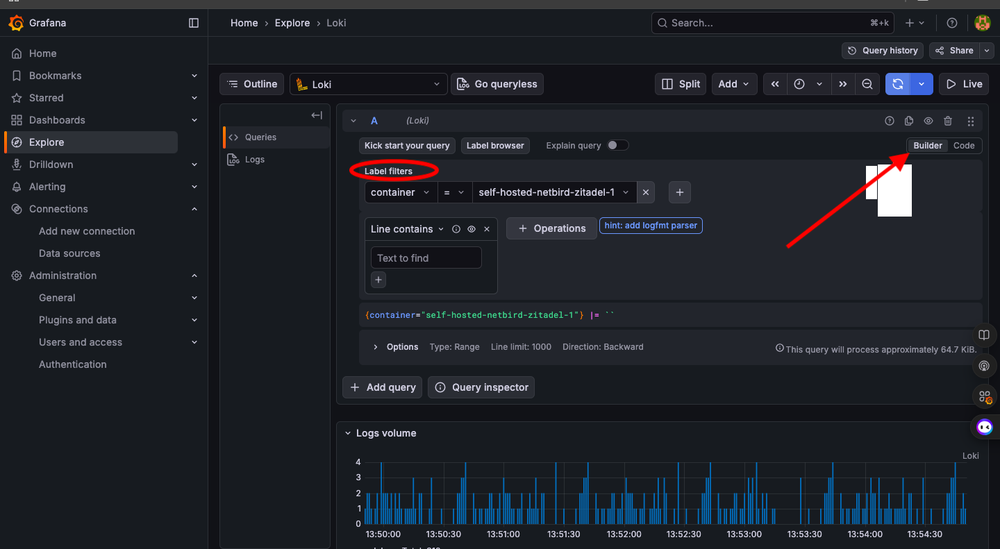

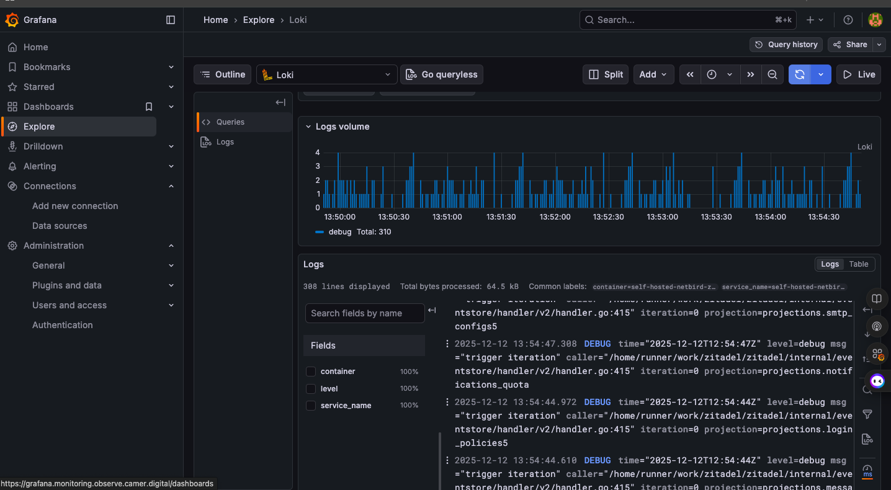

##### Test 2: Verify Container Performance (Mimir)

Go to Explore -> Prometheus (Mimir).

- Check Memory Usage:
This query shows the Top 5 memory-hungry containers on your Ubuntu server.

```Promql
topk(5, container_memory_usage_bytes{image!=""})
```

output is as shown below
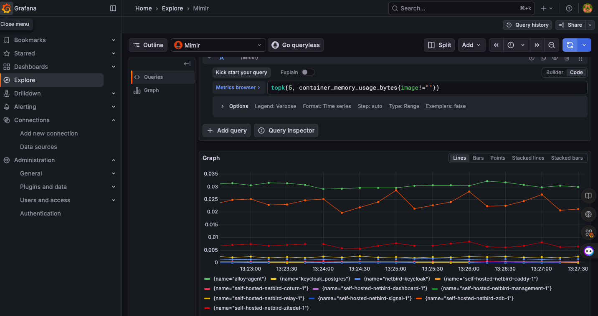

- Check CPU Usage:
This shows how much CPU core % each container is using.

```Promql
sum(rate(container_cpu_usage_seconds_total{image!=""}[1m])) by (name)
````

output is as shown below
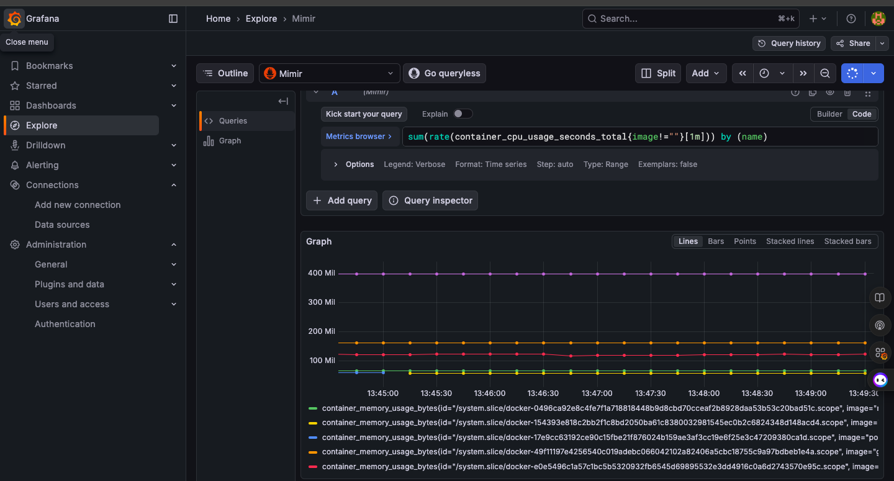

##### Test 3: Verify Tempo traces

Go to Explore -> Tempo(on the search bar).

click "search" to see traces

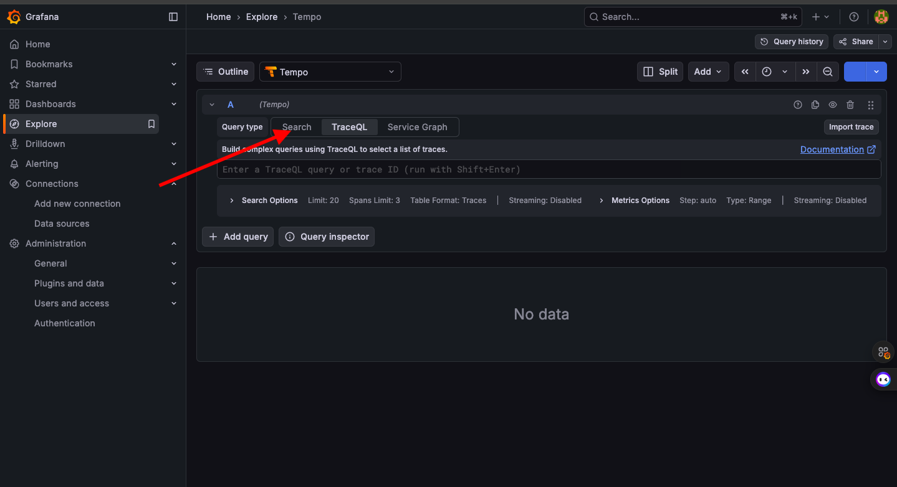

click any "trace" to view the latency of an app

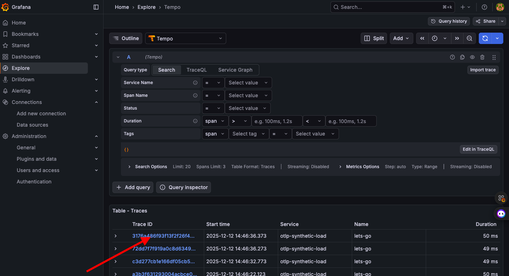

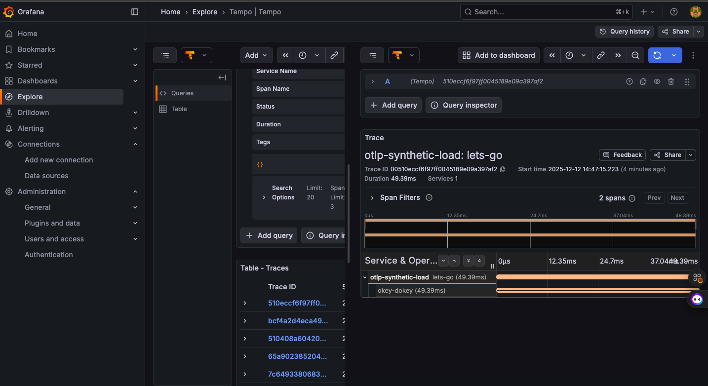

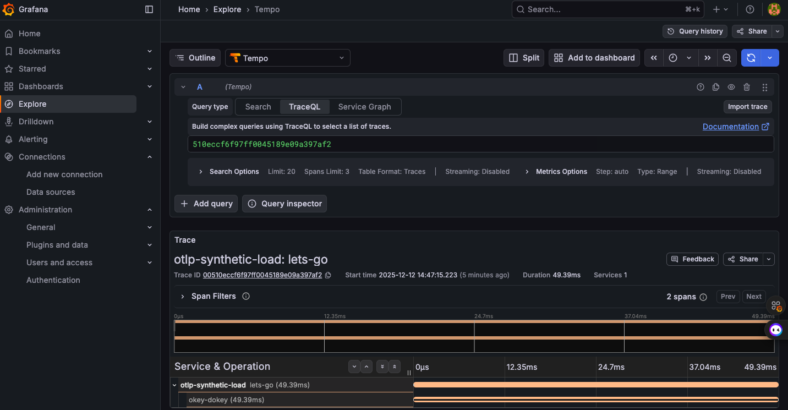
